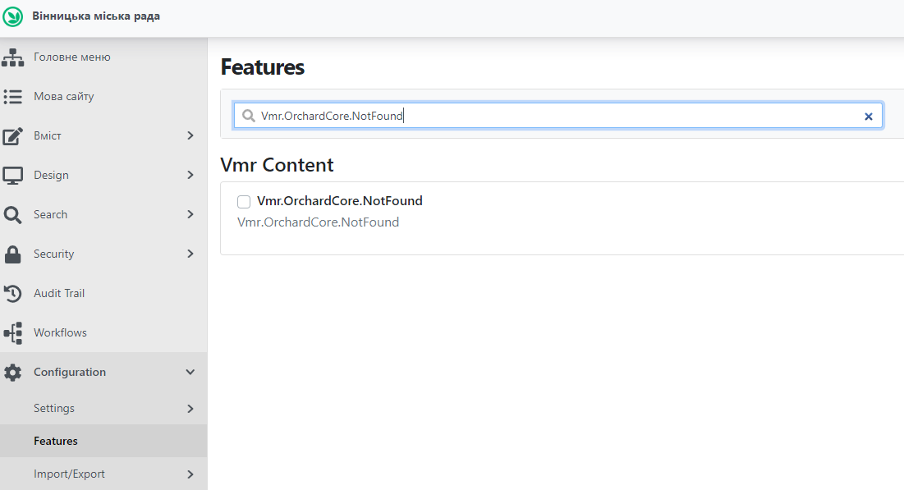
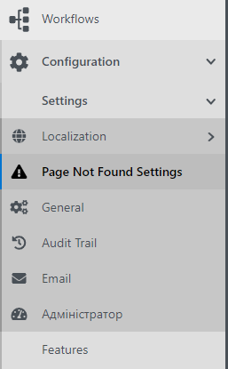
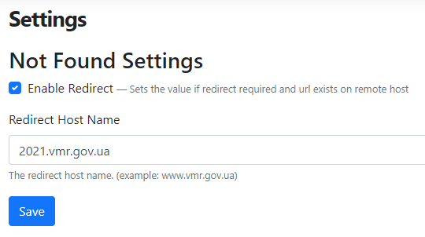
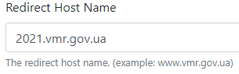

# NotFound Module

---

## Увімкнення-Вимкнення елементу

Для того, щоб увімкнути чи вимкнути елемент потрібно авторизуватись до адміністративної панелі. Після чого розкрити пункт Configuration - Features. Для швидкого пошуку елементу необхідно у блоці пошуку Features здійснити пошуковий запит за назвою елементу (Vmr.OrchardCore.NotFound).

Після знаходження елементу перевіряється його статус активності (кнопка навпроти назви елементу):  - елемент активний;  - елемент не активний.
Для зміни статусу елементу потрібно натиснути на клавішу Disable для вимкнення чи Enable для увімкнення елементу.

---

## Налаштування елементу

Для налаштування роботи елементу потрібно розкрити пункт Configuration, далі - Settings та обрати пункт Page Not Found Settings.

>(Примітка: цей пункт з'являється лише якщо елемент увімкнуто).

&nbsp;

Після обрання цього пункту, відкривається сторінка редагування елементу. 

На сторінці редагування елементу є такі поля:

1)  - чек-бокс увімкнення-вимкнення функції редіректу (перенаправлення користувача на відповідну сторінку іншого сайту (наприклад на попередній сайт ВМР))
2)  - обрання імені хоста для редіректу (наприклад ім'я хоста попереднього сайту ВМР)
3)  - Save збереження змін.

---

## Принцип роботи

Після відкриття користувачем сторінки сайту, якої не існує, користувач отримує сторінку 404.

На цій сторінці передбачені наступні сценарії поведінки Користувача:

1) якщо поточної сторінки не існує на попередньому сайті, користувач може перейти до головної сторінки поточного сайту або перейти на сторінку пошуку на поточному сайті
2) якщо поточна сторінка існує на попередньому сайті, користувач може перейти до відповідної сторінки попереднього сайту
