# Administrators Manual

[Документайція адміністратора](https://docs.vmr.gov.ua/Administrators/)

## Версії документа 

---
№ | Дата | Версія | Автор | Опис 
:---: | :---: | :---: | :---: | :---:
1 | 04.09.2020 | 1.0 | Фадєєва І.Ю. | Початкова версія 
2 | 18.06.2021 | 2.0 | Серветник Н.О. | Доповнена версія 

---

## 1 ЗАГАЛЬНІ ВІДОМОСТІ

---

Даний документ визначає загальні принципи роботи з інформаційним наповненням Офіційного Вебпорталу Вінницької міської ради.

Документ включає наступні розділи:

Розділ 1 «Загальні відомості»

Розділ 2 «Вхід до Вебпорталу» містить опис процедури входу до Вебпорталу.

Розділ 3 «Інтерфейс Системи Керування Контентом Вебпорталу» містить опис інтерфейсу Вебпорталу.

Розділ 4 «Налаштування рольової моделі» описує дії по створенню ролей та наданню прав ролям.

Розділ 5 «Управління обліковими записами користувачів» описує дії по створенню облікових записів користувачів та призначення ролей.

Розділ 6 «Управління структурою Вебпорталу» описує роботу зі структурою Вебпорталу.

Розділ 7 «Налаштування пошуку» описує принципи налаштування пошуку на Вебпорталі.

Розділ 8 «Налаштування Вебпорталу» описує принципи налаштування роботи Вебпорталу.

Розділ 9 «Робота з підпорядкованими порталами» описує дії по створенню підпорядкованих порталів.

## 2 ВХІД ДО ВЕБПОРТАЛУ

---

Для входу до Вебпорталу необхідно відкрити веб-посилання в інтернет-браузері.

Для початку роботи у Системі Керування Контентом (СКК) Вебпорталу потрібно увійти в систему за допомогою введення імені та паролю користувача.

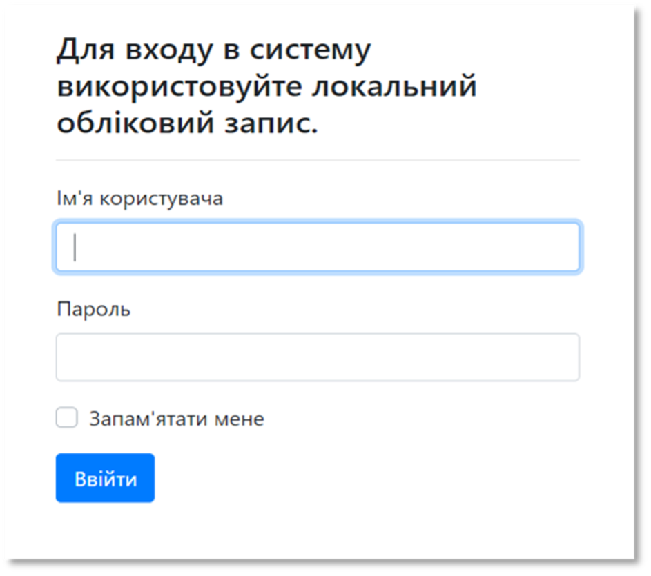

Рисунок 1 - Вхід до Вебпорталу

Після того, як користувач ввів свої дані, він переходить в Систему Керування Контентом (адміністративну частину) Вебпорталу.

Рисунок 2 - Вигляд загального меню СКК

## 3 ІНТЕРФЕЙС АДМІНІСТРАТИВНОЇ ЧАСТИНИ ВЕБПОРТАЛУ

---

Меню адміністративної частини Вебпорталу (Системи Управління Контентом) складається з 8 загальних розділів для адміністрування Вебпорталу.

1. Розділ «Новий» дозволяє створювати нові типи контенту.

2. Розділ «Головне меню» дозволяє керувати елементами головного меню.

3. Розділ «Мова сайту» дозволяє змінювати мову сайту.

4. Розділ «Вміст» дозволяє керувати контентом сторінок Вебпорталу.

5. Розділ «Дизайн» (Design) дозволяє керувати віджетами, структурою сторінок.

6. Розділ «Пошук» (Search) містить налаштування пошуку Вебпорталу.

7. Розділ «Безпека» (Security) дозволяє керувати ролями, правами доступу користувачів.

8. Розділ «Конфігурація» (Configuration) дозволяє керувати технічними налаштуваннями Вебпорталу, містить Меню адміністратора.

Рисунок 3 - Меню **СКК** 

Робота Адміністратора Вебпорталу передбачає використання таких розділів меню Системи Керування Контентом: 

- «Головне меню» 

- «Мова сайту» 

- «Вміст» 

- «Дизайн» 

- «Безпека» 

Робота з Системою керування Контентом Вебпорталу передбачає використання наступних функціональних можливостей: 

- Налаштування рольової моделі 

- Управління обліковими записами користувачів Вебпорталу 

- Управління структурою Вебпорталу 

- Технічні налаштування 

## 4 НАЛАШТУВАННЯ РОЛЬОВОЇ МОДЕЛІ 

---

Фреймворком ***Orchard Core***користувачів передбачені наступні ролі: 
 
Таблиця 1 – Опис ролей користувачів 

Роль | Опис
:--- | :---
Authenticated | авторизований користувач 
Moderator | користувач, який здійснює контроль за контентом типу коментарі і перевіряє його на відповідність правилам сайту 
Anonymous | невідомий для системи користувач, який не здійснював вхід в систему 
Administrator | користувач, що має доступ до всіх налаштувань та контенту сайту 
Editor | користувач, який можуть редагувати та публікувати контент, створений іншими користувачами, але не можуть створювати власний контент 
Author | користувач, які може створювати та публікувати контент на сайті 
Contributor | користувач, що створює контент, але не має прав на його публікацію. 

Для налаштування ролей необхідно: 

1. В меню Системи Керування Контентом перейти в розділ «Security (Безпека)». 

2. Обрати підрозділ «Roles (Ролі)». 

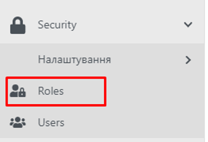

Рисунок 4 - Підрозділ "Roles" меню СКК

3. По натиску відкривається сторінка зі списком існуючих ролей:

Рисунок 5 - Список ролей 

Для налаштування ролі необхідно натиснути кнопку «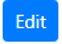» у записі потрібної ролі.

Сторінка налаштування ролі містить наступні поля:

1. Поле пошуку

2. Опис ролі

3. Опис типів дозволу:

- Allow – тип доступу, що надається явно.

- Effective – тип доступу, що може надаватися неявно (тобто разом з іншим доступом вищого рівня).

4. Перелік усіх складових сайту, до яких можна налаштувати доступ.

Рисунок 6 - Сторінка налаштування дозволів для ролі користувача до головної сторінки

Сторінка складається з переліку дій користувача та типів доступу до цих дій. Дозвіл надається шляхом відмітки типу доступу, що буде присвоєний ролі.

## 5 УПРАВЛІННЯ ОБЛІКОВИМИ ЗАПИСАМИ КОРИСТУВАЧІВ

---

Управління обліковими записами користувачів здійснюється у підрозділі «Users» розділу «Security».

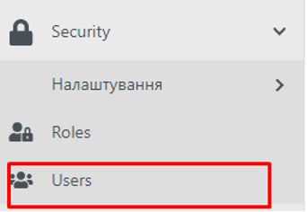

Рисунок 7 - Підрозділ "Users" меню СКК

### 5.1 СТВОРЕННЯ ОБЛІКОВОГО ЗАПИСУ КОРИСТУВАЧА

---

Для створення облікового запису користувача необхідно:

1. На сторінці зі списком користувачів натиснути кнопку «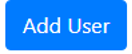»

2. Заповнити необхідні поля у формі створення користувача:

    - Ім’я користувача – вводиться логін користувача

    - Електронна адреса - Роль – вибір з набору існуючих ролей. Налаштування ролей описано у розділі 3.

3. Натиснути кнопку «».

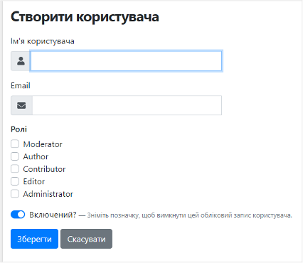

Рисунок 8 - Форма створення нового користувача

Даний користувач з’явиться в списку користувачів.

### 5.2 ДЕАКТИВАЦІЯ ІСНУЮЧОГО КОРИСТУВАЧА

---

Для деактивації існуючого користувача потрібно:

1.	Зі списку користувачів обрати користувача, якого потрібно деактивувати.

2.	Натиснути  в меню праворуч.

3.	В списку формі, що відкриється, перемкнути на «Відключити».
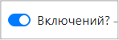

4.	Натиснути «»

5.	Користувача деактивовано.

### 5.3 ВИДАЛЕННЯ ІСНУЮЧОГО КОРИСТУВАЧА

---

Для видалення існуючого користувача потрібно:

1.	Обрати із списку потрібного користувача.

2.	В меню праворуч натиснути 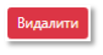.

3.	Підтвердити видалення, натиснувши ОК.

### 5.4 ЗАМІНА ПАРОЛЮ КОРИСТУВАЧА АДМІНІСТРАТОРОМ

---

Для зміни пароля існуючого користувача потрібно:

1.	Обрати зі списку потрібного користувача.

2.	В меню праворуч натиснути 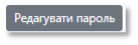.

3.	Змінити пароль.

4.	Натиснути «».

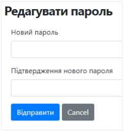

Рисунок 9 - Форма редагування паролю користувача

### 5.5 ЗМІНА РОЛІ КОРИСТУВАЧА

---

Для зміни ролі користувача необхідно: 

1.	Обрати потрібного користувача та натиснути .

2.	Відмітити прапорцем потрібну роль.

3.	Натиснути «Зберегти».

## 6 УПРАВЛІННЯ СТРУКТУРОЮ ПОРТАЛУ

---

Управління структурою Вебпорталу передбачає:

-	Управління елементами хедеру

-	Управління навігаційним меню

-	Управління елементами головної сторінки

-	Управління елементами футера

### 6.1 ЗАГАЛЬНІ ПРИНЦИПИ РОБОТИ

---

#### 6.1.1 ЕЛЕМЕНТИ УПРАВЛІННЯ СТОРІНКОЮ

---

В роботі зі сторінкою доступні наступні дії:

 - відбувається публікація створеної сторінки чи внесених змін

 - зберігається створена сторінка або внесені зміни, але публікація не відбувається

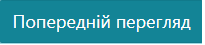 - відкривається сторінка перегляду створеної сторінки або внесених змін

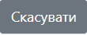 - скасовуються останні незбережені дії.

#### 6.1.2 УПРАВЛІННЯ ЕЛЕМЕНТАМИ СПИСКІВ

---

В роботі з елементами списку доступні наступні дії:

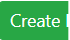 - створюється новий елемент списку

 - відкривається сторінка для редагування елементу

 - відкривається сторінка перегляду елементу 

 - 

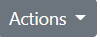 - вибір дії по відношенню до елементу:

- неопубліковано – відміна публікації сторінки;

- видалити – видалення сторінки;

- клонувати – створення копії сторінки; 

#### 6.1.3 УПРАВЛІННЯ ЕЛЕМЕНТАМИ СТОРІНКИ

---

Для зміни положення елементів сторінки потрібно:

1.	Затиснути курсор.

2.	Перенести елемент в потрібне положення.

3.	Натиснути «».

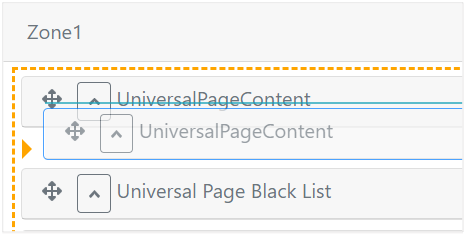

Рисунок 10 - Переміщення елементів сторінки

Для видалення елемента сторінки необхідно натиснути на кнопку «».

Для перегляду атрибутів елементу потрібно розгорнути форму елемента, натиснувши кнопку «». По натиску на кнопку «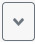» форма згортається.

#### 6.1.4 ЗАВАНТАЖЕННЯ ФАЙЛІВ

---

Завантаження файлів на сторінки здійснюється з Медіа-Лабораторії. 
 
 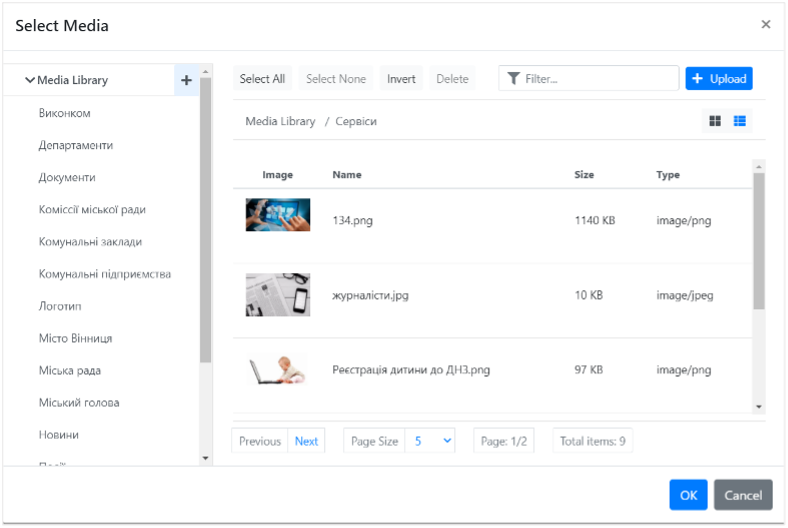

Рисунок 11 - Медіа-лабораторія

Файли можна згрупувати по папках. Для завантаження файлів у визначену папку потрібно обрати її у меню зліва. Для створення папки необхідно натиснути «» та ввести назву папки. Кожна папка може містити власні папки.

Щоб завантажити файли до Медіа-Лабораторії необхідно:

1.	Натиснути .

2.	У стандартному вікні завантаження файлів MS Windows обрати необхідні файли.

3.	Підтвердити завантаження натиском на кнопку «Ок».

### 6.2 УПРАВЛІННЯ ЕЛЕМЕНТАМИ ХЕДЕРУ

---

Для роботи з Хедером потрібно перейти в меню Системи Керування Контентом, розділ «Дизайн». Обрати підрозділ «Widgets (Віджети)». 
 
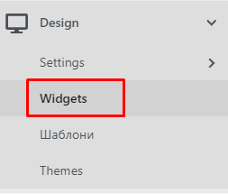

Рисунок 12 - Підрозділ "Widgets" у меню адміністративної частини Вебпорталу

Хедер містить наступні елементи:

- Віджет «Важлива інформація»;

- Віджет «Carousel». 

    Робоча область сторінки «Widgets (Віджети)» містить список віджетів, що розміщуються на головній сторінці та список layers, які визначають місце розміщення віджету.
        
    Layers:

    -	Always – означає, що віджет буде відображатися на усіх сторінках Вебпорталу
    -	Homepage – означає, що віджет буде відображатися лише на Головній сторінці Вебпорталу.
 
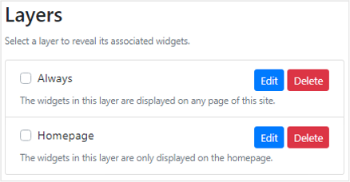

Рисунок 13 - Варіанти відображення елементів

#### 6.2.1 РОБОТА З ВІДЖЕТОМ «ВАЖЛИВА ІНФОРМАЦІЯ»

---

Робота з віджетом «Важлива інформація» передбачає можливість редагувати вміст віджету та визначати наявність віджету на сторінці.

Для редагування віджету необхідно натиснути кнопку « 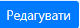» в записі віджету «Важлива інформація» на сторінці «Widgets (Віджети)».
 
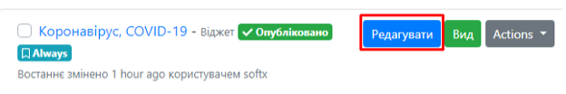

Рисунок 14 - Віджет "Важлива інформація"

По натиску відкривається форма редагування віджету:
 
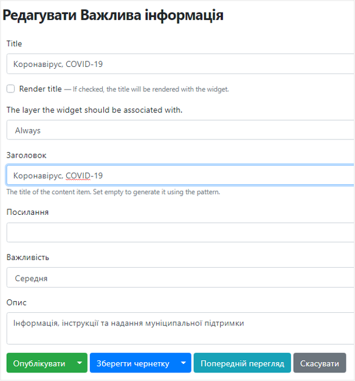

Рисунок 15 - Форма створення віджету "Важлива інформація"

1.	**Title** – назва віджету. Назву можна відображати. Для цього потрібно відмітити 

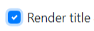
 
2.	**Layers** - вибір місця відображення віджету: на усіх сторінках Вебпорталу чи лише на Головній сторінці, потрібно обрати із списку.

3.	**Заголовок** – містить заголовок інформаційного повідомлення.

4.	**Опис** – опис повідомлення.

5.	**Посилання** - містить URL – посилання на сторінку з інформацією.

6.	**Важливість** – визначає важливість повідомлення, відображається різним кольором залежності від ступеню важливості:

    -	Червоний – Висока важливість;

    -	Жовтий – Середня важливість;

    -	Зелений – Низька важливість.

Після внесення необхідних змін потрібно натиснути кнопку «».

У разі необхідності віджет «Важлива інформація» можна не відображати на сторінках Вебпорталу. Для цього необхідно обрати «Неопубліковано» у випадаючому меню кнопки «Actions» в списку віджетів на сторінці «Widgets (Віджети)»:
 
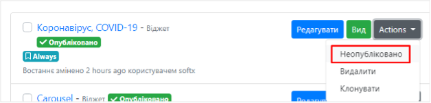

Рисунок 16 - Робота з віджетом "Важлива інформація"

та підтвердити дію:
 

Рисунок 17 - Діалогове вікно підтвердження дії

Для того, щоб опублікувати віджет необхідно обрати «Опублікувати проект» у випадаючому меню кнопки «Actions» в списку віджетів на сторінці «Widgets (Віджети)»:

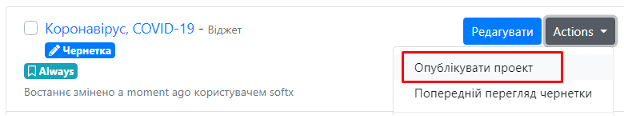

Рисунок 18 - Робота з віджетами

#### 6.2.2 РОБОТА З БАНЕРОМ

---

Для роботи з банером необхідно натиснути кнопку «» в записі віджету «Carousel» на сторінці «Widgets (Віджети)».
 
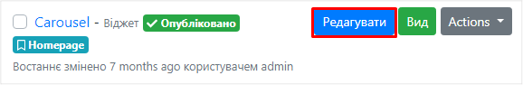

Рисунок 19 - Робота з віджетом «Carousel»

По натиску відкривається форма редагування віджету:
 
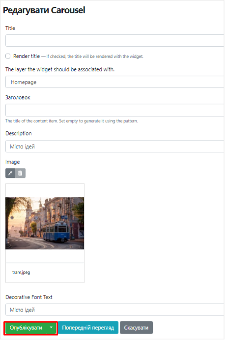

Рисунок 20 - Форма редагування віджету «Carousel»

1.	**Title** - назва віджету. Назву можна відображати. Для цього потрібно відмітити 

2.	**Layers** - вибір місця відображення віджету: на усіх сторінках Вебпорталу чи лише на Головній сторінці, потрібно обрати із списку.

3.	**Заголовок** – містить заголовок банеру.

4.	**Description (опис)** - містить текст, що відображається на банері.

5.	**Decorative Font Text** – містить текст, що відображається на банері декоративним шрифтом.

6.	**Image** - містить зображення, що розміщене на банері.
Для збереження необхідних змін потрібно натиснути кнопку ««»».

### 6.3 РОБОТА З ЛОГОТИПОМ ВЕБПОРТАЛУ

---

Для редагування логотипу Вебпорталу необхідно у розділі «Content Types» меню адміністративної частини обрати підрозділ «Логотип сайту».

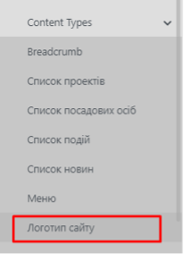

Рисунок 21 - Пункт «Логотип сайту» в меню

Відкриється вікно редагування логотипу:

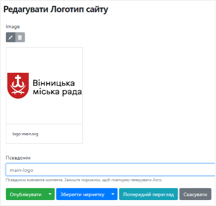
 
Рисунок 22 - Редагування логотипу

Для зміни зображення необхідно видалити поточний файл по натиску на кнопку «» та завантажити новий. Щоб зберегти зміни потрібно натиснути кнопку «».

### 6.4 УПРАВЛІННЯ НАВІГАЦІЙНИМ МЕНЮ

---

Для початку роботи з навігаційним меню необхідно обрати розділ «Головне меню» в меню адміністративної частини.

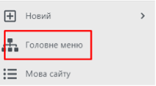

Рисунок 23 - Пункт «Головне меню» в меню

Відкриється сторінка редагування головного меню:

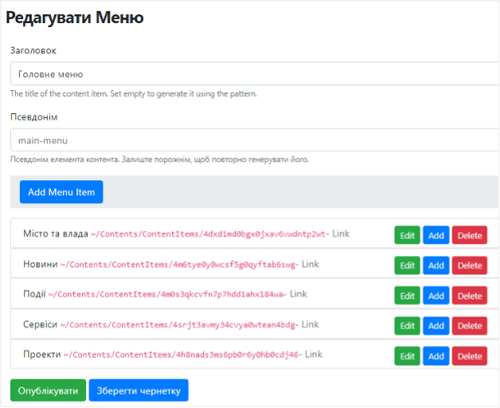

Рисунок 24 - Форма редагування Головного меню

#### 6.4.1 РЕДАГУВАННЯ ЕЛЕМЕНТІВ ГОЛОВНОГО МЕНЮ

---

Для редагування елементів потрібно обрати розділ та в меню праворуч натиснути кнопку «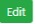». Відкриється вікно редагування елементу головного меню:
 
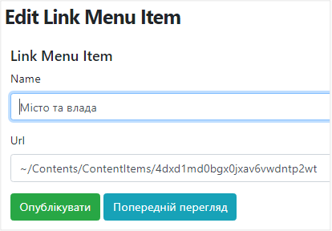

Рисунок 25 - Форма додавання розділу Головного меню

1.	Name – назва розділу.

2.	URL – стале посилання.

Для збереження необхідних змін потрібно натиснути кнопку «».

#### 6.4.2 ЗМІНА ПОЛОЖЕННЯ РОЗДІЛУ ГОЛОВНОГО МЕНЮ

---

Для зміни положення розділів головного меню потрібно:

4.	Затиснути курсор.

5.	Перенести розділ в потрібне положення.

6.	Натиснути «».

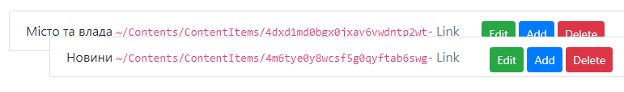

Рисунок 26 - Переміщення елементів Головного меню

#### 6.4.3 СТВОРЕННЯ НОВОГО РОЗДІЛУ ГОЛОВНОГО МЕНЮ

---

Для створення нового розділу головного меню необхідно натиснути кнопку «» та обрати:
 
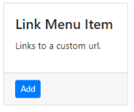
У відкритому вікні створення нового розділу меню необхідно заповнити поля:
 

Рисунок 27 - Форма створення розділу Головного меню

1.	Name – назва розділу.

2.	URL – стале посилання.

Для збереження нового розділу потрібно натиснути кнопку «».

### 6.5 УПРАВЛІННЯ ЕЛЕМЕНТАМИ ГОЛОВНОЇ СТОРІНКИ

---

Робоча область Головної сторінки складається з віджетів:

-	Пошук;

-	Новини міста;

-	Найближчі події;

-	Популярні сервіси;

-	Проекти;

-	Міська влада.

Для роботи з наповненням Головної сторінки потрібно перейти в розділ «Design» меню Системи Керування Контентом та обрати підрозділ «Widgets (Віджети)». 

 
Рисунок 28 - Підрозділ "Widgets" у меню адміністративної частини Вебпорталу

#### 6.5.1 РЕДАГУВАННЯ ВІДЖЕТУ «ГОЛОВНИЙ ПОШУК»

---

Для редагування віджету необхідно натиснути кнопку «» в записі віджету «Головний пошук» на сторінці «Widgets (Віджети)».

Відкриється сторінка редагування віджету:
 
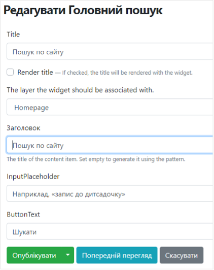

Рисунок 29 - Форма редагування віджету «Головний пошук»

1.	**Title** - назва віджету. Назву можна відображати. Для цього потрібно відмітити 

 
2.	**Layers** - вибір місця відображення віджету: на усіх сторінках Вебпорталу чи лише на Головній сторінці, потрібно обрати із списку.

3.	**Заголовок** – містить заголовок елементу на Головній сторінці.

4.	**InputPlaceholder** – текст-підказка, що відображається в полі пошуку.

5.	**ButtonText** – надпис на кнопці, що запускає процес пошуку.

Після внесення необхідних змін потрібно натиснути кнопку «».

#### 6.5.2 РЕДАГУВАННЯ ВІДЖЕТУ «НОВИНИ МІСТА»

---

Для редагування віджету необхідно натиснути кнопку «» в записі віджету «Новини міста» на сторінці «Widgets (Віджети)».

Відкриється сторінка редагування віджету:

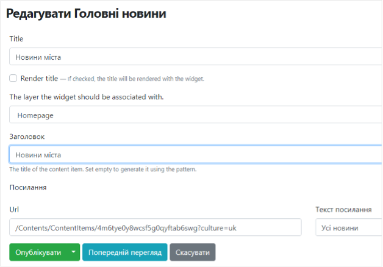
 
Рисунок 30 - Форма редагування віджету «Новини міста»

1.	**Title** - назва віджету. Назву можна відображати. Для цього потрібно відмітити 
 

2.	**Layers** - вибір місця відображення віджету: на усіх сторінках Вебпорталу чи лише на Головній сторінці, потрібно обрати із списку.

3.	**Заголовок** – містить заголовок розділу на головній сторінці.

4.	**Посилання** – посилання на каталог новин

5.	**Текст посилання** – надпис до посилання на каталог новин.

Після внесення необхідних змін потрібно натиснути кнопку «».

### 6.5.3 РЕДАГУВАННЯ ВІДЖЕТУ «НАЙБЛИЖЧІ ПОДІЇ»

---

Для редагування віджету необхідно натиснути кнопку «» в записі віджету «Найближчі події» на сторінці «Widgets (Віджети)».

Відкриється сторінка редагування віджету:

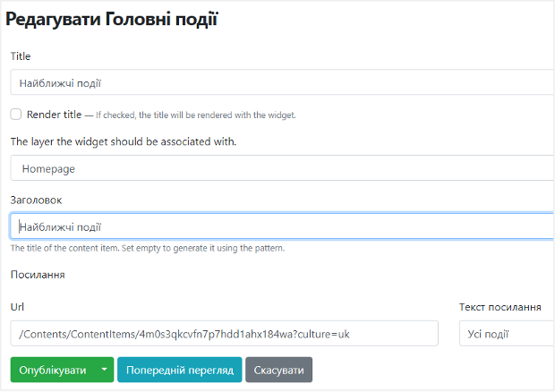

Рисунок 31 - Форма редагування віджету «Найближчі події»

1.	**Title** - назва віджету. Назву можна відображати. Для цього потрібно відмітити 

2.	**Layers** - вибір місця відображення віджету: на усіх сторінках Вебпорталу чи лише на Головній сторінці, потрібно обрати із списку.

3.	**Заголовок** – містить заголовок розділу на головній сторінці.

4.	**Посилання** – посилання на каталог подій.

5.	**Текст посилання** – надпис до посилання на каталог подій.
Після внесення необхідних змін потрібно натиснути кнопку «».

#### 6.5.4	РЕДАГУВАННЯ ВІДЖЕТУ «ПОПУЛЯРНІ СЕРВІСИ»

---

Для редагування віджету необхідно натиснути кнопку «» в записі віджету «Популярні сервіси» на сторінці «Widgets (Віджети)».

Відкриється сторінка редагування віджету:

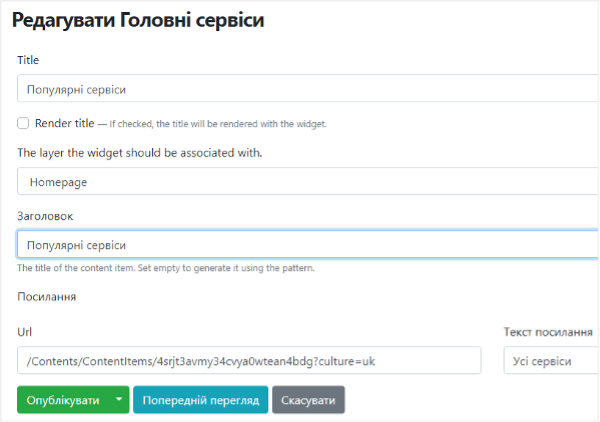
 
Рисунок 32 - Форма редагування віджету «Сервіси»

1.	**Title** - назва віджету. Назву можна відображати. Для цього потрібно відмітити 

2.	**Layers** - вибір місця відображення віджету: на усіх сторінках Вебпорталу чи лише на Головній сторінці, потрібно обрати із списку.

3.	**Заголовок** – містить заголовок розділу на головній сторінці.

4.	**Посилання** – посилання на сторінку популярних сервісів

5.	**Текст посилання** – надпис до посилання на сторінку популярних сервісів.

Після внесення необхідних змін потрібно натиснути кнопку «».

#### 6.5.5 РЕДАГУВАННЯ ВІДЖЕТУ «ПРОЕКТИ»

---

Для редагування віджету необхідно натиснути кнопку «» в записі віджету «Проекти» на сторінці «Widgets (Віджети)».

Відкриється сторінка редагування віджету:

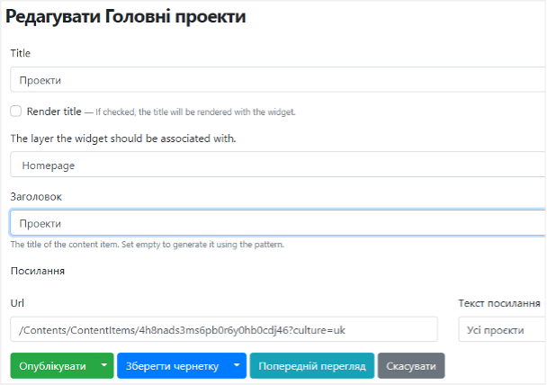
 
Рисунок 33 - Форма редагування віджету «Проекти»

1.	**Title** - назва віджету. Назву можна відображати. Для цього потрібно відмітити 
 

2.	**Layers** - вибір місця відображення віджету: на усіх сторінках Вебпорталу чи лише на Головній сторінці, потрібно обрати із списку.

3.	**Заголовок** – містить заголовок розділу на головній сторінці.

4.	**Посилання** – посилання на каталог проектів

5.	**Текст посилання**– надпис до посилання на каталог проектів.

Після внесення необхідних змін потрібно натиснути кнопку «».

#### 6.5.6	РЕДАГУВАННЯ ВІДЖЕТУ «МІСЬКА ВЛАДА»

---

Для редагування віджету необхідно натиснути кнопку «» в записі віджету «Міська влада» на сторінці «Widgets (Віджети)».

Відкриється сторінка редагування віджету:
 
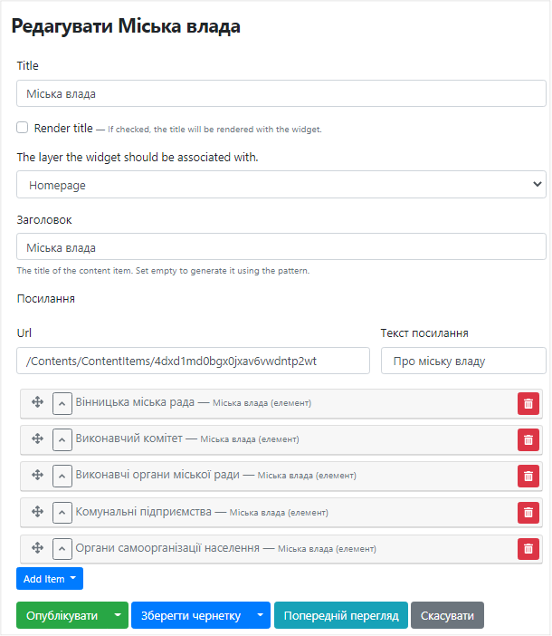

Рисунок 34 - Форма редагування віджету «Міська влада»

1.	**Title** - назва віджету. Назву можна відображати. Для цього потрібно відмітити 

2.	**Layers** - вибір місця відображення віджету: на усіх сторінках Вебпорталу чи лише на Головній сторінці, потрібно обрати із списку.

3.	**Заголовок** – містить заголовок розділу на головній сторінці.

4.	**Посилання** – посилання на сторінку «Місто та влада».

5.	**Текст посилання** – надпис до посилання на сторінку «Місто та влада».

6.	**Блок «Вінницька міська рада»**:

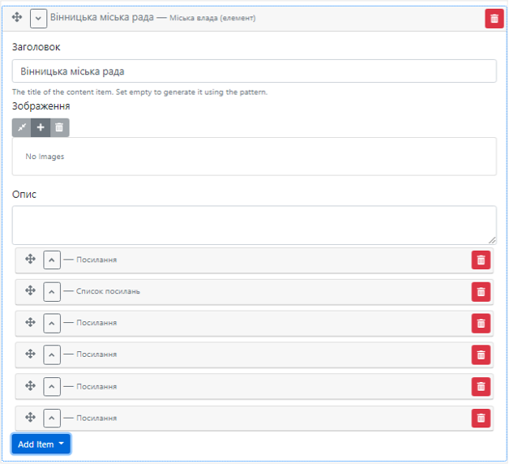

Рисунок 35 - Форма редагування блоку «Вінницька міська рада»

**Заголовок** – назва блоку «Вінницька міська рада»;

**Зображення** – вибір зображення до блоку;

**Опис** – опис до блоку;

**Посилання** – додавання посилань до блоку. Містить URL-адресу та текст посилання.

7. **Блок «Виконавчий комітет»:**

**Заголовок** – назва блоку «Виконавчий комітет»;

**Зображення** - вибір зображення до блоку;

**Опис** – опис до блоку;

**Посилання** – додавання посилань до блоку. Містить URL-адресу та текст посилання.

**Список файлів** – додавання файлів до блоку. Містить назву файлу, файл та опис до нього.

 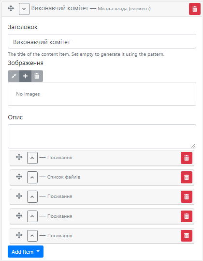

Рисунок 36 - Форма редагування блоку «Виконавчий комітет»

8. **Блоки «Виконавчі органи міської ради», «Комунальні підприємства» та «Органи самоорганізації населення»** мають однакову структуру:

**Заголовок** – назва відповідного розділу;

**Зображення** – при необхідності передбачена можливість вибору зображення до блоку.

**Посилання** - додавання посилань до блоку. Містить URL-адресу та текст посилання.

**Список файлів** – додавання файлів до блоку. Містить назву файлу, файл та опис до нього.

Після внесення необхідних змін потрібно натиснути кнопку «».
