# Керівництво  Редактора (контент - менеджера)

---

## Загальні відомості

Даний документ визначає загальні принципи роботи з інформаційним
наповненням Офіційного Вебпорталу Вінницької міської ради.

Документ включає наступні розділи:

Розділ 1 «Загальні відомості»

Розділ 2 «Вхід до Вебпорталу» містить опис процедури входу до
Вебпорталу.

Розділ 3 «Інтерфейс Системи Керування Контентом Вебпорталу» містить опис
інтерфейсу Вебпорталу.

Розділ 4 «Загальні принципи роботи» містить інформацію про загальні
принципи роботи з Системою Керування Контентом.

Розділ 5 «Робота по наповненню Вебпорталу контентом» містить опис
процедур наповнення контентом.

## Вхід до Вебпорталу

Для початку роботи у Системі Керування Контентом (СКК) Вебпорталу
необхідно авторизуватися за *[посиланням](https://vmr.gov.ua/admin)* 

У відкритій формі авторизації ***потрібно натиснути на "VMR Azure AD" та вказати логін та пароль.***

>ВАЖЛИВО Логін - електронна пошта, яку вказував Користувач на запит про надання доступу до редагування сайту. Пароль - створюється Користувачем після відкриття посилання, яке надсилається під час запиту про надання доступу.

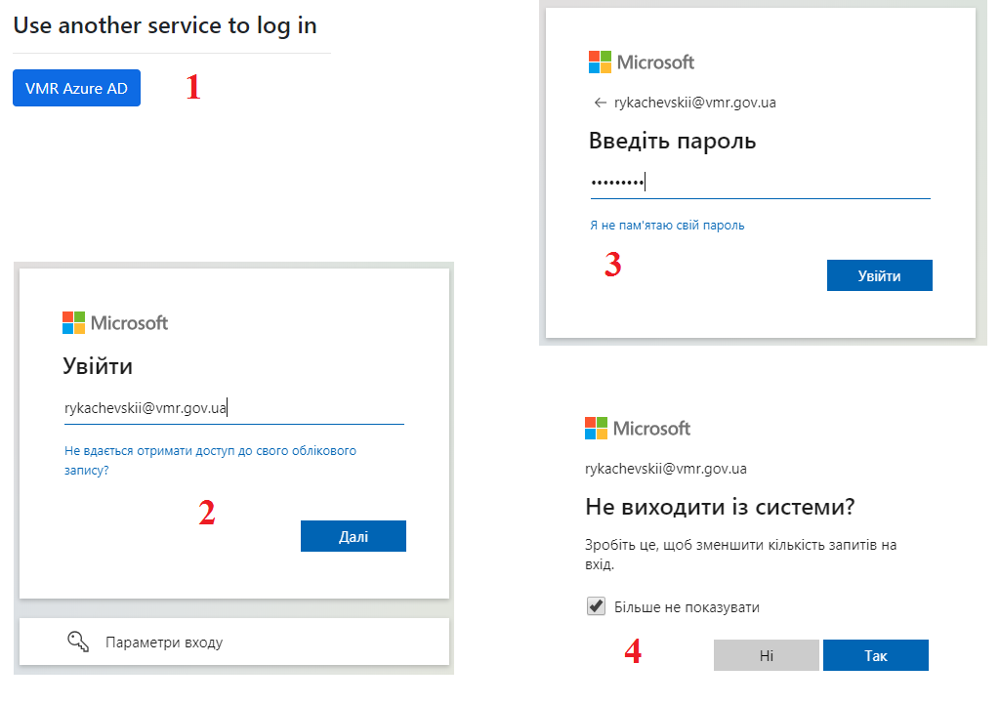

Рисунок 1 - Вхід до Вебпорталу

Для авторизованого користувача стає доступним перехід до
адміністративної частини порталу за допомогою віджету модератора, що
розміщений у хедері
«».

По натиску на «» на головній сторінці користувач
переходить на головну сторінку Системи Керування Контентом
(адміністративної частини) Вебпорталу.

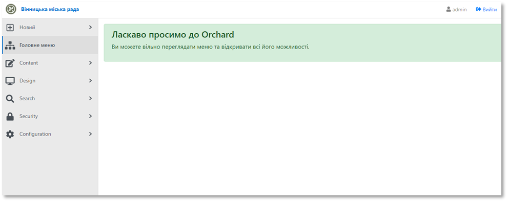

Рисунок 2 -- Адміністративна частина Вебпорталу

---

## Інтерфейс системи керування контентом

Система Управління Контентом Вебпорталу складається з 7 загальних
розділів для адміністрування Вебпорталу. Для роботи контент-менеджера
призначені підрозділи «Content Types» та «Media Library» розділу
«Content (Вміст)» меню СКК.

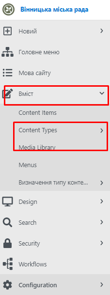

Рисунок 3 -- Розділи меню СКК

---

## Загальні принципи роботи

### Загальне оформлення сторінок Вебпорталу

Специфіка оформлення сторінок Вебпорталу базується на використанні
наступних елементів:

1)  «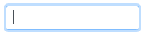» - текстове поле -- призначений для
    введення текстових або числових даних.

2)  «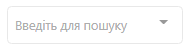» - випадаючий список - призначений
    для вибору одного значення з списку доступних значень.

3)  «» - елемент вибору «чек-бокс» -
    призначений для встановлення вибору
    «», або виключення
    «».

4)  поле завантаження файлів:

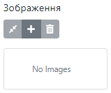По натиску на
«» відкривається «Медіа-лабораторія» для вибору файлу.
Після вибору потрібного файлу зі списку доступних файлів по натиску
лівої клавіши маніпулятора типу «миша» на кнопку
«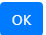» файл буде завантажений до форми.

> Для видалення файлу треба натиснути на
> «».

5)  «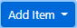» - призначений для додавання
    елементів контенту шляхом вибору одного значення зі списку
    доступних.

6)  текстовий редактор дозволяє форматувати текст, використовуючи
    інструменти панелі форматування:

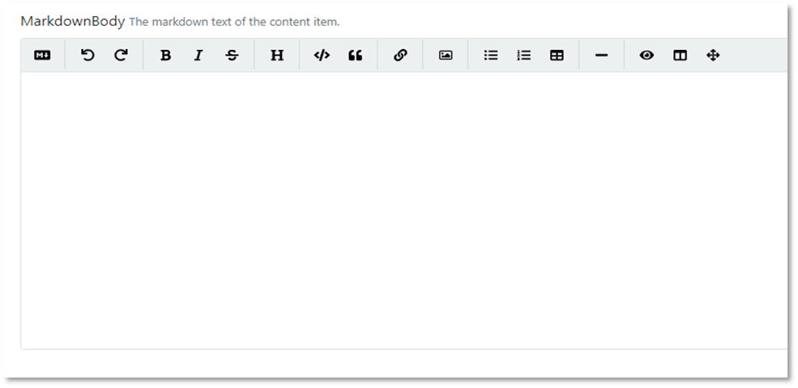

Рисунок 3 - Панель форматування

7)  Посилання -- призначений для розміщення посилань на внутрішні та
    зовнішні ресурси. При розміщенні на сторінці посилань на внутрішні
    ресурси потрібно вказувати відносні посилання. Наприклад:

> http://vmr.gov.ua/departament-osvity-vmr - абсолютне посилання;
>
> /departament-osvity-vmr -- відносне посилання.

#### Робота з текстовим редактором

1\) 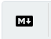 - керівництво по MarkDownBody (Панель форматування)

2\) 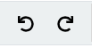 - відміна дії та відміна відміни дії

3\) 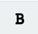 - виділення жирним шрифтом

4\)  - виділення курсивом

5\) 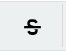 - закреслення

6\) 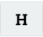 - заголовок

7\) 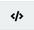 - вставлення коду

8\) 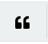 - лапки

9\) 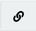 -
вставка гіперпосилання.

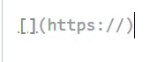 - у шаблоні, що з'явиться, заповнити
інформацію для гіперпосилання.

10\) 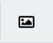 - додавання зображення.

11\) 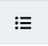 - маркерований список

12\) 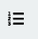 - нумерований список

13\) 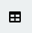 - вставка таблиці

Пропонується шаблон з трьох колонок і рядків, які можна редагувати.

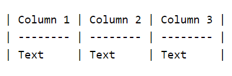

14\) 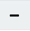
- горизонтальне підкреслення тексту

15\) 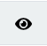 - вмикнути попередній перегляд

16\) 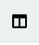 - вмикнути попередній перегляд
пліч-о-пліч

17\) 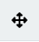- повноекранний вид

18\) 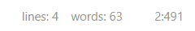 - показник кількості рядків, слів,
символів

### Елементи управління сторінкою

В роботі зі сторінкою доступні наступні дії:

 - відбувається публікація створеної
сторінки чи внесених змін

 - зберігається створена сторінка або
внесені зміни, але публікація не відбувається

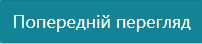 - відкривається сторінка перегляду
створеної сторінки або внесених змін

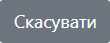 - скасовуються останні незбережені дії.

### Управління елементами сторінки

Для зміни положення елементів сторінки потрібно:

1.  Затиснути курсор.

2.  Перенести елемент в потрібне положення.

3.  Натиснути
    «».

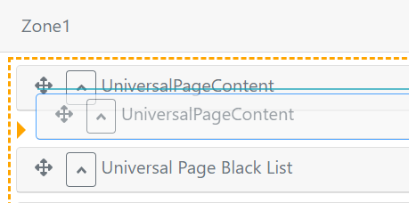

Рисунок 4 - Переміщення елементів сторінки

Для видалення елемента сторінки необхідно натиснути на кнопку
«».

Для перегляду атрибутів елементу потрібно розгорнути форму елемента,
натиснувши кнопку
«». По натиску на кнопку
«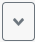» форма згортається.

### Управління елементами списків

В роботі з елементами списку доступні наступні дії:

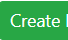 - створюється новий елемент списку

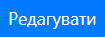 - відкривається сторінка для редагування
елементу

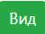 - відкривається сторінка перегляду
елементу

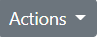 - вибір дії по відношенню до елементу:

> \- неопубліковано -- відміна публікації сторінки;
>
> \- видалити -- видалення сторінки;
>
> \- клонувати -- створення копії сторінки;

### Робота з Бібліотекою медіа

Завантаження файлів та зображень на сторінки здійснюється з Бібліотеки медіа. Щоб перейти до Бібліотеки, потрібно у адміністративній панелі розкрити Вміст та обрати Media Library. 
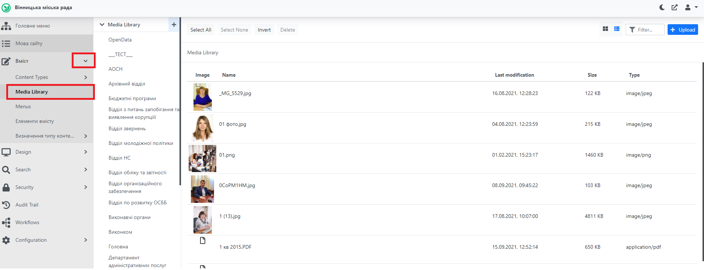

Рисунок 5 - Медіа-лабораторія

Файли потрібно групувати по папках. Для завантаження файлів у визначену
папку потрібно обрати її у меню зліва. Для створення папки необхідно
натиснути клавішу , яка знаходиться ліворуч над списком файлів, ввести назву папки та натиснути Ok. 

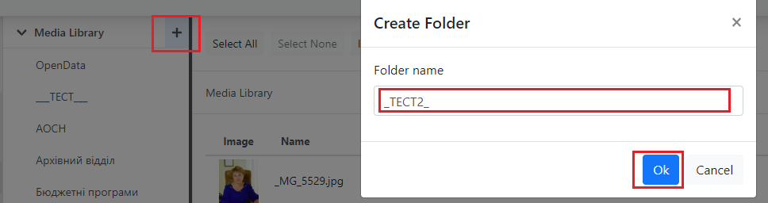

Кожна папка може містити власні папки. Для створення підпапки потрібно натиснути на піктограму "+" навпроти назви папки та ввести назву.

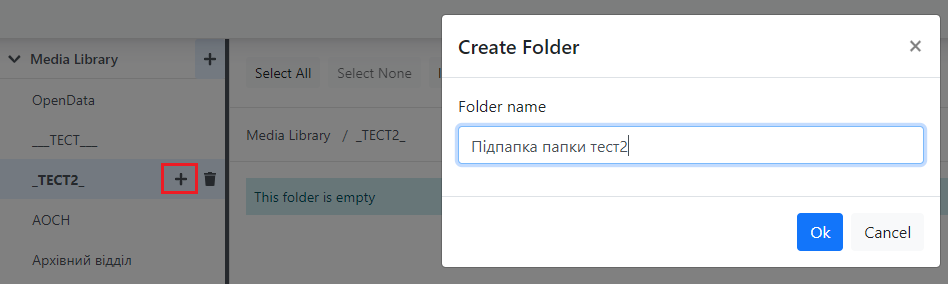

Щоб завантажити файли до Медіа-Лабораторії необхідно:

1.  Натиснути .

2.  У стандартному вікні завантаження файлів MS Windows обрати необхідні
    файли.

3.  Підтвердити завантаження натиском на кнопку «Ок».

>ВАЖЛИВО: існує можливість завантаження декількох файлів одночасно.

Процес створення підпапки та завантаження файлів показано нижче.

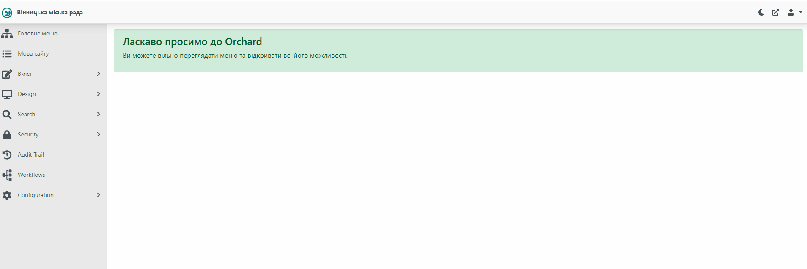

### Робота з списками класифікаторів (партія, комісія, посада)

На багатьох сторінках існують поля, у яких здійснюється обирання значення із списку, що запропоновано. Наприклад це поле обрання класифікаторів для сторінки новини, партії для сторінки депутата, посади для посадової особи.

#### Класифікатори

Класифікатор - описує тему, до якої належить наприклад новина. Для редагування цього списку потрібно (*[перейти](https://docs.vmr.gov.ua/ContentEditors/ContentEditor_Manual/#_2)*) до Адміністративної панелі, розкрити список Вміст - Content Types - Taxonomy та обрати список Класифікатори.

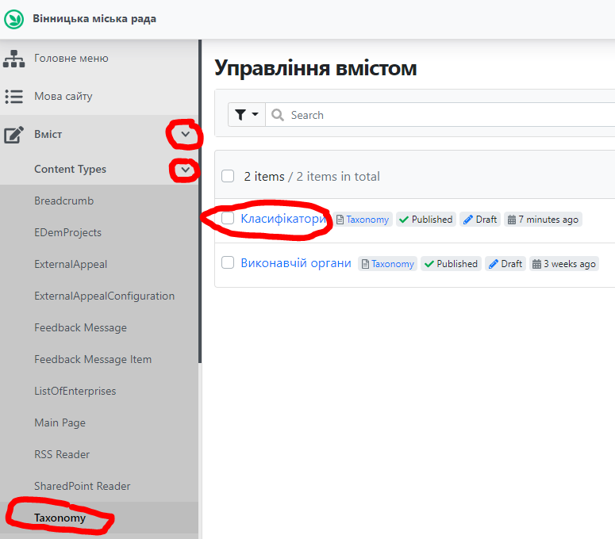

Для додавання нового класифікатора потрібно натиснути "Add Класифікатор" у списку, що відкрився. Ввести назву нового класифікатора у полі "Заголовок" та натиснути "Опублікувати" для збереження. Після цього класифікатор стає доступним у відповідних полях, наприклад на сторінці новини. Для редагування наявного класифікатора потрібно натиснути "Edit" навпроти класифікатора. 

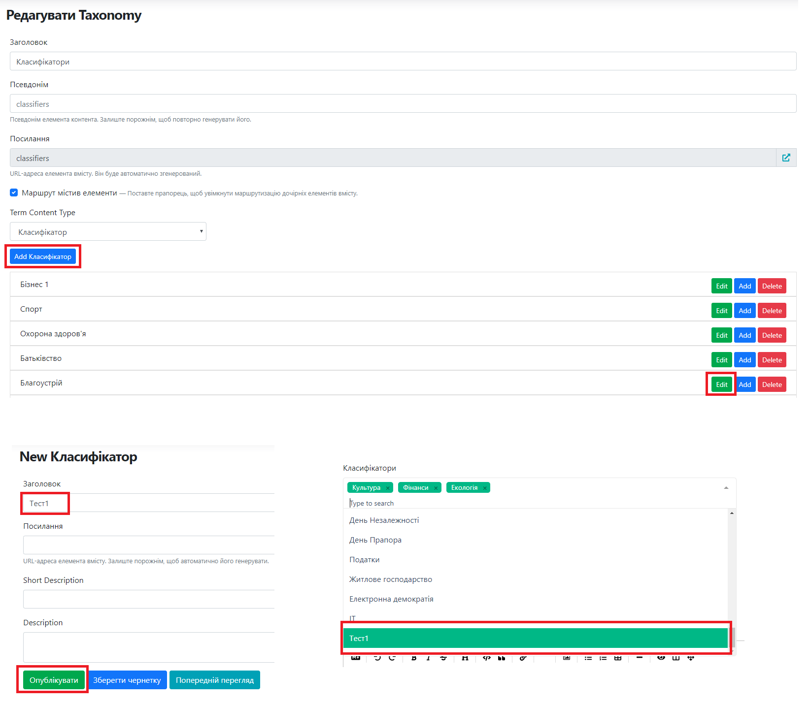

#### Партія, Комісія, Посада

Для додавання нових елементів потрібно (*[перейти](https://docs.vmr.gov.ua/ContentEditors/ContentEditor_Manual/#_2)*) до Адміністративної панелі, розкрити список Вміст - Content Types та обрати відповідний список: Партія, Комісія, Посада.

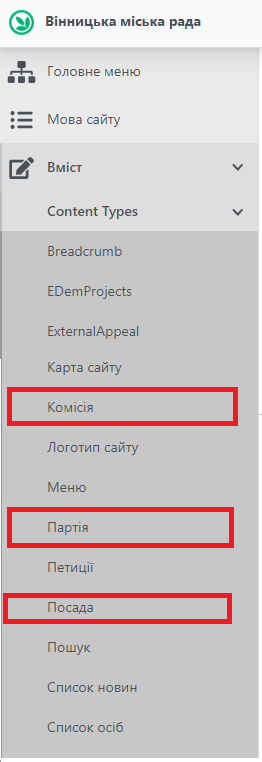

Для додавання нового елементу для списків потрібно натиснути відповідну клавішу та заповнити відповідні поля. Приклад заповнення полів для кожного списку подано нижче. 

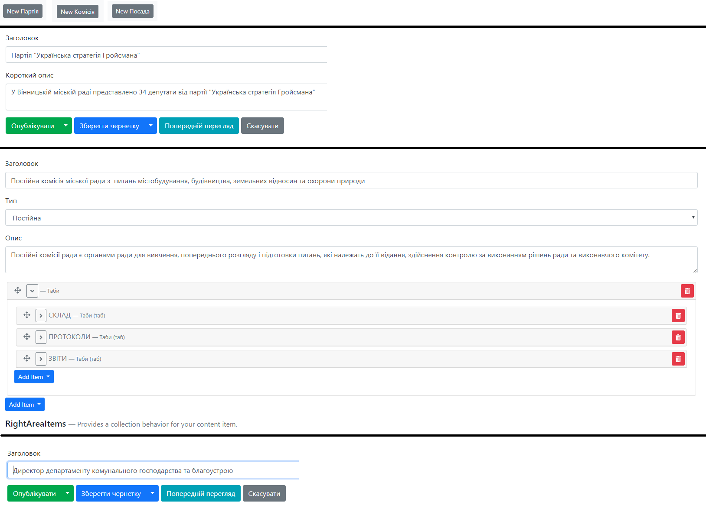

### Елементи сторінок

#### Посилання 

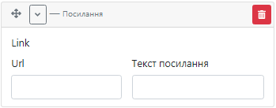

Url-адрес -- вказати посилання на потрібну сторінку.

Текст посилання -- вказати текст посилання (обов'язкове поле).

#### Список посилань

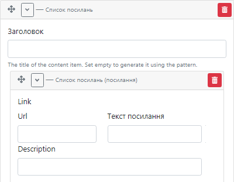

> -- вказати заголовок до списку посилань
>
> \- вказати посилання на потрібну сторінку та текст посилання.
>
> -- вказати опис до посилання.

Елемент «Список посилань» використовується у випадку, коли необхідно
відобразити контент у наступному вигляді:

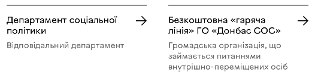

#### Контакти до списку посилань

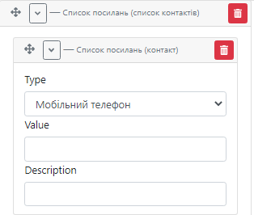

> -- вибрати вид контакту: телефон або адреса.
>
> -- вказати телефон або адресу.
>
> \- додати опис до контакту.

Елемент «Контакти до списку посилань» використовується у випадку, коли
необхідно відобразити контент у наступному вигляді:

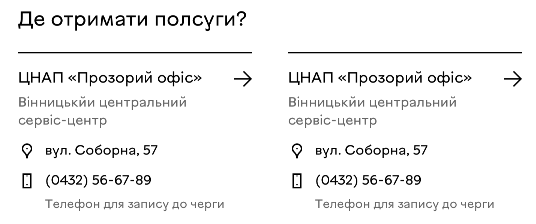

#### Список файлів

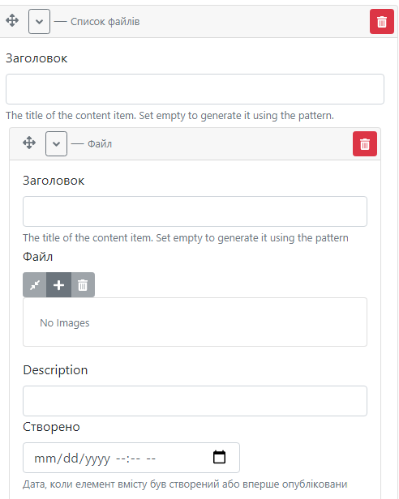

\- вказати назву до списку файлів.

-   вказати назву окремого файлу.

-- обрати потрібний файл з Медіа-лабораторії.

> \- вказати опис до файлу.

\- вказати дату публікації файлу.

#### Посилання на сервіси

-- вказати назву сервісу

-- обрати потрібний сервіс зі списку.

#### Параграф

Віджет містить наступні елементи:

 - вказати назву інформаційного розділу.

 - ідентифікатор розділу, вказати числове
значення. За допомогою ідентифікатор забезпечується навігація по
сторонці: встановлюється зв\'язок між розділом та посиланням на нього в
навігаційному меню.

**Текстовий редактор -** робота з елементом описана у п. 4.1.1.

**Посилання** - робота з елементом описана у п. 4.6.1

**Список посилань** -- робота з елементом описана у п. 4.6.2.

**Контакти до списку посилань** -- робота з елементом описана у п.
4.6.3.

**Посилання на сервіси** - робота з віджетом описана у п. 4.6.5.

Список файлів -- робота з віджетом описана у п.4.6.4.

#### Навігація по сторінці (Page Navigation)

Заголовок -- додати назву навігаційного блоку.

Url - вказати ідентифікатор розділу, до якого має вести посилання.

Текст посилання -- вказати назву розділу, до якого має вести посилання.

#### Особи 

Віджет забезпечує відображення існуючої особи з можливістю перейти на
сторінку профіля:

\- вказати заголовок до елементу.

-   вибрати особу зі списку.

#### Відео 

Віджет дозволяє додати відео або зображення:

> -- додати підпис до відео або зображення
>
> -- вибрати відео-файл з Медіа-лабораторії.
>
> -- вибрати зображення з Медіа-лабораторії.

#### Tabs (Вкладки)

Віджет «Tabs (Вкладки)» складається з окремих вкладок -- «Tab»:

> \- вказати назву вкладки.

На кожній вкладці передбачено можливість використання наступних
елементів:

Appeal Management -- робота з віджетом описана у п. 4.6.15.

Contact List --робота з віджетом описана у п. 4.6.11.

Department Unit -- робота з віджетом описана у п. 4.6.12.

Image (Зображення) -- робота з віджетом описана у п. 4.6.13

Текстовий редактор -- робота з елементом описана у п. 4.1.1.

Особи -- робота з віджетом описана у п. 4.6.8.

Social Media -- робота з віджетом описана у п. 4.6.14.

Посилання -- робота з віджетом описана у п. 4.6.1.

Список посилань - робота з віджетом описана у п. 4.6.2.

Список файлів - робота з віджетом описана у п. 4.6.4.

#### Contact List 

Віджет дозволяє додавати список контактів:

\- вказати заголовок до списку контактів.

-- вказати ПІБ контактної особи або інший підпис до елементу списку.

-   вказати назву контакту.

> \- вказати значення контакту.

#### Department Unit

Віджет призначений для відображення списку осіб з фото:

-- вказати назву списку.

-- вказати додатковий заголовок.

-- вказати опис до списку.

Список осіб Department Unit складається з елементів Department Unit
Worker:

\- вказати ПІБ особи.

\- вказати посаду.

> \- обрати фото з Медіа-лабораторії.

\- вказати номер кабінету.

\- вказати номер телефону.

\- вказати електронну адресу.

Department Unit Link -- призначений для відображення посилання в списку
осіб (наприклад, вакансії у відділі).

-- вказати посилання на сторінку та текст посилання.

-- опис до посилання.

#### Image (Зображення)

-- вказати назву зображення.

-- вибрати файл з Медіа-лабораторії.

-- вказати текст, що буде відображатися при наведенні курсора на
зображення.

#### Social Media

Віджет призначений для відображення посилань на сторінки в соціальних
мережах. Містить заголовок та елементи списку:

\- ввести назву списку.

\- обрати соціальну мережу зі списку

\- вказати посилання на сторінку в соціальній мережі.

\- додати опис за потребою.

#### Appeal Management 

Віджет дозволяє додавати посилання на форму звернення:

\- ввести текст посилання. Наприклад, «Звернутися до директор
департаменту».

#### Vertical Tabs (Вертикальні вкладки)

-   вказати назву вкладки.

На кожній вертикальній вкладці передбачено можливість використання
наступних елементів:

Appeal Management -- робота з віджетом описана у п. 4.6.15.

Contact List -- робота з віджетом описана у п. 4.6.11.

Department Unit -- робота з віджетом описана у п. 4.6.12.

Image (Зображення) - робота з віджетом описана у п. 4.6.13.

Текстовий редактор - робота з елементом описана у п. 4.1.1.

Особи -- робота з віджетом описана у п. 4.6.8.

Social Media -- робота з віджетом описана у п. 4.6.14.

Посилання - робота з віджетом описана у п. 4.6.1.

Список посилань - робота з віджетом описана у п. 4.6.2.

Список файлів - робота з віджетом описана у п. 4.6.4.

---

### Альтернативний текст

**Для забезечення доступності сайту міської ради впроваджено додаткові властивості до всіх зображень - альтернативний текст та текстову підказку.** 

Ця ініціатива допомагає людям з обмеженими можливостями, таким як відвідувачі з вадами зору або користувачі з використанням асистивних технологій, отримати інформацію, яка є на зображеннях.

**Альтернативний текст, також відомий як ALT-текст**, - це короткий опис зображення, який відображається в тому випадку, якщо саме зображення не може бути завантажено або не відображається. В цьому тексті слід описувати зміст та функцію зображення, допомагаючи читачу зрозуміти, що воно зображує. Альтернативний текст має бути конкретним і точно передавати те, що зображено на картинці. Наприклад, "Група людей на засіданні міської ради".

**Текстова підказка, відома також як title-атрибут**, надає додаткову інформацію при наведенні курсору на зображення. Це може бути короткий пояснювальний текст, який розширює контекст зображення, але необов'язково повторює альтернативний текст. Підказка повинна бути короткою, чіткою та зрозумілою. Наприклад, "Фото засідання міської ради з мером та членами громадської ради".

Заповнення параметрів зображення "Альтернативний текст" та "Текстова підказка" є обов'язковим для всіх типів сторінок (новини, події, сервіси, універсальні сторінки та інші)

*Блок "Альтернативний текст" та "Текстова підказка" до головного зображення новини:*
 

 *Блок "Альтернативний текст" та "Текстова підказка" до зображення:*
 

 *Блок "Альтернативний текст" та "Текстова підказка" до логотипу соціальних мереж:*
 

*Для зображень, які вставлені у текстовому полі MarkdownBody, також обов'язково додавати параметр альтернативного тексту (ALT):*

>синтаксис для вставки альтернативного тексту виглядає як "[image alt="Альтернативний текст"](URL_зображення)[/image]"*

 

## Робота по наповненню Вебпорталу контентом

Управління контентом Вебпорталу представлено для користувачів, що
виконують функції контент -- менеджерів Вебпорталу.

Управління контентом Вебпорталу передбачає:

-   Створення та публікація новин Вебпорталу -- п.5.1;

-   Створення та публікація подій Вебпорталу -- п.5.2;

-   Створення та публікація сервісів Вебпорталу -- п.5.3;

-   Створення та публікація проектів Вебпорталу -- п.5.4;

-   Створення та публікація сторінки посадової особи -- п.5.5;

-   Створення та публікація сторінки департаменту -- п.5.6;

-   Створення та публікація сторінки комунального підприємства -- п.5.7;

-   Редагування опублікованих сторінок Вебпорталу.

-   Роботу з універсальними контент-сторінками Вебпорталу заданої
    структури: Місто та влада, Комісії міської ради та інші.

###  Робота із новинами Вебпорталу

Для роботи з новинами необхідно у списку «Типи вмісту» розділу «Вміст»
обрати пункт «Список новин»:

Рисунок 6 - Список новин в меню

В робочій області зайти на список «Новини міста»:

Рисунок 7 - Список «Новини міста»

####  Створення та публікація новин 

Для створення новини необхідно натиснути кнопку
«» на сторінці зі списком новин.
Відкриється форма створення новини:

 - ввести назву новини.

 - url-адреса формується автоматично.

 - вибір головного зображення новини.
Детальний опис додавання файлу зображення поданий у п. 4.5.

\- додати підпис до зображення.

- відмітити, якщо новина має
відображатися на Головній сторінці Вебпорталу.

- відмітити, якщо новина має статус
«Важливо». Статус «Важливо» означає, що новина впливає на життя містян
протягом певного вказаного часу. Відображається на сторінці каталогу
новин праворуч.

 - додати короткий опис новини.

- вибір класифікаторів зі словника.

\- вибір відповідального за подію департаменту.

**Текстовий редактор** -- вказати основну інформацію про подію, робота з
елементом описана у п. 4.1.1.

**Галерея зображень** -- додати зображення до новини:

-- вказати назву до галереї зображень.

-   вказати підпис до кожного окремого зображення.

-- обрати зображення з Медіа-лабораторії.

**Посилання** - за необхідності додати посилання на ресурси, пов'язані з
новиною, робота з віджетом описана у п. 4.6.1

**Список файлів** -- за необхідності додати релевантні файли, робота з
віджетом описана у п. 4.6.4

**Сервіс «Для журналістів»** - робота з віджетом описана у п. 4.6.5.

Для публікації новини необхідно натиснути
«».

####  Редагування новини

Для редагування новини потрібно:

1.  В списку новин в адміністративній частині обрати новину, що потребує
    > редагування та натиснути
    > «» або на публічній сторінці новини
    > натиснути
    > «» у хедері.

2.  У формі редагування новини внести необхідні зміни.

3.  Натиснути
    > «».

Зміни внесені та одразу з'являються на сайті.

--- 

### Робота із подіями Вебпорталу

Для роботи з подіями необхідно у списку «Типи вмісту» розділу «Вміст»
обрати пункт «Список подій»:

Рисунок 8 - Список подій в меню

В робочій області зайти на список «Події»:

Рисунок 9 - Список «Події міста»

####  Створення та публікація події

Для створення події необхідно натиснути кнопку
«» на сторінці зі списком подій.
Відкриється форма створення події:

\- ввести назву події.

\- url-адреса формується автоматично.

**Locations** -- призначений для можливості вказати посилання на місце
проведення:

\- вказати назву місця проведення

\- вказати посилання на місце проведення

\- вибір головного зображення події. Детальний опис додавання файлу
зображення у п. 4.5.

\- вибір дати та часу початку та закінчення події з календаря.

 - додати короткий опис події.

- вибір класифікаторів зі словника.

 - додати місце проведення події (для
відображення в картці події).

\- вибір відповідального за подію департаменту.

- вказати посилання на форму реєстрації на
подію.

**Текстовий редактор** -- вказати основну інформацію про подію, робота з
елементом описана у п. 4.1.1.

**Місце проведення події на карті:**

-- вказати назву місця проведення.

-- вказати посилання на карту з позначкою місця проведення у форматі
html-коду для вставки карти.

Для відображення підписів до карти передбачено розділ Locations:

-- вказати назву місця проведення.

> -- вказати посилання на карту з позначкою місця проведення у форматі
> html-коду для вставки карти.

**Сервіс «Для журналістів»** - робота з віджетом описана у п. 4.6.5.

Для публікації події необхідно натиснути
«».

#### Редагування події

Для редагування події потрібно:

1.  В списку подій обрати подію, що потребує редагування та натиснути
    > «»або на публічній сторінці події
    > натиснути
    > «» у хедері.

2.  У формі редагування події внести необхідні зміни.

3.  Натиснути
    > «».

Зміни внесені та одразу з'являються на сайті.

---

#### Створення життєвої ситуації

Для створення життєвої ситуації необхідно у списку «Типи вмісту» розділу
«Вміст» обрати пункт «Життєва ситуація»:

Рисунок 12 - Пункт «Життєва ситуація» в меню

Натиснути кнопку
«» та заповнити форму, що відкрилася:

\- вказати назву життєвої ситуації.

\- url-адреса формується автоматично.

\- додати короткий опис життєвої ситуації.

\- вибрати сервіси, що входять до життєвої ситуації.

Для детальнішого опису життєвої ситуації передбачено використання
елементу **Параграф** -- робота з віджетом описана у п. 4.6.6.

Для швидкого доступу до необхідної інформації на сторінці життєвої
ситуації передбачено використання віджету **«Навігація по сторінці (Page
Navigation)»** - робота з віджетом описана у п. 4.6.7.

Для публікації життєвої ситуації необхідно натиснути
«».

#### Редагування життєвої ситуації

Для редагування життєвої ситуації потрібно:

1.  В списку життєвих ситуацій обрати ситуацію, що потребує редагування,
    > та натиснути
    > «» або на публічній сторінці життєвої
    > ситуації натиснути

> «» у хедері.

2.  У формі редагування внести необхідні зміни.

3.  Натиснути
    > «».

Зміни внесені та одразу з'являються на сайті.

---

### Робота із проектами Вебпорталу

Для роботи з проектами необхідно у списку «Типи вмісту» розділу «Вміст»
обрати пункт «Список проектів»:

Рисунок 14 - Список проектів в меню

В робочій області зайти на список «Проекти»:

Рисунок 15 - Список «Проекти»

####  Створення та публікація проекту

Для створення проекту необхідно натиснути кнопку
«» на сторінці зі списком проектів. Відкриється форма
створення проекту:

 - ввести назву сервісу.

 - url-адреса формується автоматично.

**Текстовий редактор** -- робота з елементом описана у п. 4.1.1

 - додати текст, що відображається на
банері декоративним шрифтом.

 - вибір головного зображення події.
Детальний опис додавання файлу зображення у п. 4.5.

- вибір класифікаторів зі словника.

 - додати короткий опис події.

\- обрати відповідальний за подію департамент.

Картка пов'язаного проекту:

-- додати опис до картки пов'язаного проекту.

-- обрати пов\'язаний проект зі списку.

Контактна група проекту містить список контактних осіб:

> -- додається автоматично «Контактна група проекту».
>
> -- додати фото (або інше зображення) учасника контактної групи
> проекту.
>
> -- додати url-адресу на сторінку учасника (за наявності).
>
> -- вказати ПІБ (або назву) учасника контактної групи проекту.
>
> -- додати опис учасника.

Етап проекту:

> Заголовок -- вказати назву етапу проекту.
>
> Статус виконання -- обрати статус виконання етапу проекту: очікується
> виконання, виконується, виконано, ще буде...

Для відображення змісту етапу передбачено використання наступних
елементів:

Текстовий редактор -- робота з елементом описана у п. 4.1.1

Відео -- дозволяє додати відео або зображення, робота з віджетом описана
у п. 4.6.9.

**Посилання** -- робота з віджетом описана у п. 4.6.1

Слайдер -- дозволяє додавати зображення, які можна перегортати:

-- обрати зображення до слайду з Медіа-лабораторії.

-- додати опис до слайду.

**Список посилань** -- робота з віджетом описана у п. 4.6.2

**Список файлів** -- робота з віджетом описана у п. 4.6.4.

\- вказати назву виконавця етапу проекту

\- додати опис

-   додати посилання на сторінку виконавця

Для публікації проекту необхідно натиснути
«».

#### Редагування проекту

Для редагування проекту потрібно:

1.  В списку проектів обрати проект, що потребує редагування, та
    > натиснути

> «»або на публічній сторінці проекту
> натиснути «» у хедері.

2.  У формі редагування проекту внести необхідні зміни.

3.  Вказати, чи відправляти оновлення підписникам:

4.  Натиснути
    > «».

Зміни внесені та одразу з'являються на сайті.

---

##### Створення сторінки депутата/уповноваженого

\- вибір партії, яку представляє депутат.

\- вказати дату початку виконання обов'язків посадовою особою. Для
депутата необхідно обов'язково вказати дату закінчення виконання
обов'язків (+ 5 років від дати виборів).

\- вибір комісії, до якої входить депутат.

\- вибір ролі депутата у складі комісії.

Для уповноваженого необхідно вказати лише дату початку та закінчення
виконання обов'язків.

#### Редагування сторінки посадової особи

Для редагування сторінки особи потрібно:

5.  В списку осіб обрати сторінку, що потребує редагування, та натиснути

> «» або на публічній сторінці посадової
> особи натиснути
> «» у хедері.

6.  У формі редагування сторінки особи внести необхідні зміни.

7.  Натиснути
    > «».

Зміни внесені та одразу з'являються на сайті.

---

### Робота із сторінкою «Комунальне підприємство»

Для роботи зі сторінкою «Комунальне підприємство» необхідно у списку
«Типи вмісту» розділу «Вміст» обрати пункт «ListofEnterprises»:

Рисунок 19 - Список комунальних підприємств в меню

В робочій області зайти на \"Список комунальних підприємств»:

Рисунок 20 - Список «List of Enterprises»

Для налаштування бредкрампс для комунальних підприємств необхідно
натиснути

«» та заповнити форму бредкрампс -- робота
з віджетом описана у п.4.6.1.

####  Створення та публікація сторінки «Комунальне підприємство»

Для створення нової сторінки комунального підприємства необхідно
натиснути кнопку

«» на сторінці зі списком підприємств.
Відкриється форма створення сторінки комунального підприємства:

 - вказати назву комунального підприємства.

 - url-адреса формується автоматично.

\- вибір департаменту, якому підпорядковується комунальне підприємство.

 - вказати «Комунальне підприємство».

\- додати короткий опис. Наприклад, «Комунальне підприємство Вінницької
міської ради»

Для відображення основного змісту сторінки комунального підприємства
передбачено використання елементу «Tabs (Вкладки)», що складається з
окремих вкладок -- «Tab» - робота з віджетом описана у п. 4.6.10.

Для зручного розміщення інформації на кожній вкладці передбачено
використання вертикальних вкладок - робота з віджетом описана у п.
4.6.16.

Для публікації сторінки департаменту необхідно натиснути
«».

#### Редагування сторінки «Комунальне підприємство»

Для редагування сторінки комунального підприємства потрібно:

1.  В списку комунальних підприємств обрати сторінку підприємства, що
    > потребує редагування, та натиснути
    > «»або на публічній сторінці
    > комунального підприємства натиснути
    > «» у хедері.

2.  У формі редагування сторінки комунального підприємства внести
    > необхідні зміни.

3.  Натиснути
    > «».

Зміни внесені та одразу з'являються на сайті.

### Робота зі сторінкою «Комісія»

Для роботи зі сторінкою «Комісія» необхідно у списку «Типи вмісту»
розділу «Вміст» обрати пункт «Комісія»:

#### Створення та публікація сторінки «Комісія»

Для створення нової сторінки комісії необхідно натиснути кнопку
«» на сторінці зі списком комісій.
Відкриється форма створення сторінки комісії:

\- вказати назву комісії.

\- обрати тип комісії.

 - додати опис комісії.

Для відображення основного змісту сторінки посадової особи передбачено
використання елементу «Tabs (Вкладки)», що складається з окремих вкладок
-- «Tab» - робота з віджетом описана у п. 4.6.10.

На кожній вкладці передбачено можливість використання наступних
елементів:

**Комісія (склад)** -- призначений для відображення списку депутатів, що
входять до складу комісії:

\- обрати комісію.

**Події** -- призначений для додавання картки події на сторінку комісії:

\- обрати подію зі списку наявних.

Для публікації сторінки комісії необхідно натиснути
«».

#### Редагування сторінки «Комісія»

Для редагування сторінки комісії потрібно:

1.  В списку комісій обрати комісію, що потребує редагування, та
    > натиснути

> «» або на публічній сторінці комісії
> натиснути «» у хедері.

2.  У формі редагування комісії внести необхідні зміни.

3.  Натиснути
    > «».

Зміни внесені та одразу з'являються на сайті.

### Робота з універсальною сторінкою

Для створення сторінки, відмінної від описаних шаблонів, передбачено
використання універсальної контент-сторінки.

Щоб розпочати роботу з унверсальною сторінкою необхідно у списку «Типи
вмісту» розділу «Вміст» обрати пункт «Універсальна контент сторінка»:

Рисунок 22 - Універсальна сторінка в меню

#### Створення та публікація універсальної сторінки

Для створення нової універсальної сторінки необхідно натиснути кнопку

«» на сторінці зі списком універсальних
сторінок. Відкриється форма створення універсальної сторінки:

 - ввести назву сторінки.

 - url-адреса формується автоматично.

 - додати короткий опис до сторінки.

**Бредкрампс** - призначений для відображення проміжних елементів
навігаційного ланцюга. Задається за допомогою елементу «Посилання»,
робота з віджетом описана у п. 4.6.1.

Візуально універсальна сторінка поділена на дві зони Zone1 - ліва
частина сторінки, та Zone2 - права частина сторінки.

Для логічного відображення контенту передбачено поділ сторінки на
розділи.

**Universal Page Black List** -- призначений для відображення структури
міської ради та складається з окремих структурних одиниць -- City
Council Structure Item:

\- вказати назву структурної одиниці

\- вказати ідентифікатор розділу.

\- вказати кількість працівників

\- додати файл з Медіа-лабораторії

\- додати опис.

**Universal Page Gray List** --призначений для відображення розділу, що
містить список посилань.

\- вказати заголовок до розділу

\- вказати ідентифікатор розділу.

\- вказати url-адресу та текст посилання

\- додати опис до посилання.

Параграф -- робота з віджетом описана у п. 4.6.6.

За межами розділів для наповнення сторінки можна використовувати:

Image (Зображення) - робота з віджетом описана у п.

Текстовий редактор -- робота з елементом описана у п. 4.1.1.

«Tabs (Вкладки)», що складається з окремих вкладок -- «Tab» - робота з
елементом описана у п. 4.6.10.

Для швидкого доступу до необхідної інформації на універсальній сторінці
передбачено використання віджету «Навігація по сторінці (Page
Navigation)» - робота з віджетом описана у п. 4.6.7.

#### Редагування універсальної сторінки

Для редагування універсальної сторінки потрібно:

1.  В списку універсальних сторінок обрати сторінку, що потребує
    > редагування, та натиснути
    > «» або на публічній сторінці, що
    > потребує редагування, натиснути
    > «» у хедері.

2.  У формі редагування сторінки внести необхідні зміни.

3.  Натиснути
    > «».

Зміни внесені та одразу з'являються на сайті.

### Додавання на сторінки Вебпорталу інформації з інших ресурсів

+----------------------+-----------------------+-----------------------+
| Засіб інтеграції     | Назва ресурсу         | Віджет                |
+======================+=======================+=======================+
| Відображення даних з | investinvinnytsia.com | RSS Reader            |
| ресурсів шляхом RSS  |                       |                       |
| підписки             | vinnytsia.city        |                       |
|                      |                       |                       |
|                      | c4b.com.ua            |                       |
+----------------------+-----------------------+-----------------------+
| Відображення мапи    | map.vmr.gov.ua        | FRAME                 |
+----------------------+-----------------------+-----------------------+
| Публікація відкритих | opendata.gov.ua       | Пакети організації    |
| даних департаментів  |                       |                       |
| ВМР                  |                       |                       |
+----------------------+-----------------------+-----------------------+
| Візуалізація обраних | i.gov.ua              | SharePoint Reader     |
| списків даних        |                       |                       |
| Порталу послуг       |                       |                       |
+----------------------+-----------------------+-----------------------+

#### Робота з віджетом взаємодії по протоколу RSS

Віджет взаємодії по протоколу RSS призначений для відображення
інформації зі сторонніх ресурсів, які мають RSS-канал.

Для створення сторінки, що містить віджет взаємодії по протоколу RSS,
потрібно обрати пункт «RSS Reader» в меню адміністративної системи:

та натиснути кнопку  в правому верхньому куті робочої області.

Для додавання віджету на універсальну сторінку необхідно в формі
створення сторінки зі списку віджетів обрати віджет «RSS Reader».

У формі створення віджету заповнити наступні поля:

 - вказати назву сторінки (заголовок розділу).

\- вказати url-адресу на rss-канал, інформація з якого має розміщуватися
на сторінці.

Для публікації сторінки необхідно натиснути
«».

#### Робота з віджетом Vinnitsa Map

Віджет Viinitsa Map призначений для відображення карти map.vmr.gov.ua на
сторінках порталу.

Для додавання віджету на сторінку необхідно в формі створення сторінки
зі списку віджетів обрати віджет «Vinnitsa Map».

У формі створення віджету заповнити наступні поля:

\- вказати масштаб

\- вказати координату широти

\- вказати координату довготи

\- вказати назву слою

\- вказати підпис до карти

Та обрати потрібний слой чи карту зі списку (відмітити галочкою
чекбокс).

Для публікації сторінки необхідно натиснути
«».

####  Робота з віджетом Пакети організації

1.  Для того, щоб почати роботу з віджетом Пакет організації, в меню
    Системи Керування Контентом потрібно перейти в розділ «Вміст», «Типи
    контенту».

2.  Обрати «Пакети організацій»

3.  Заповнити необхідні атрибути, назву пакету організації

4.  З випадаючого списку обрати потрібну організацію.

5.  Натиснути «Опублікувати».

Рисунок 59 -- Робота з віджетом Пакети організацій

####  Робота з віджетом Share Point Reader

1.  Для того, щоб почати роботу з віджетом Share Point Reader, потрібно
    в меню Системи Керівництва Контентом обрати розділ «Вміст»,
    підрозділ «Типи контенту».

2.  Оберіть вкладку Share Point Reader.

3.  Для створення сторінки за допомогою віджету Share Point Reader

> натисніть .

4.  Заповніть необхідні атрибути.

5.  Атрибут Заголовок заповнюється стандартно для атрибутів такого типу.

6.  URL формується із використанням ідентифікатора списку даних та
    представлення.

Наприклад:

[https://i.gov.ua/\_api/Web/Lists(\'List_id')/Views(\'Views_id\')/ViewFields](https://i.gov.ua/_api/Web/Lists('List_id’)/Views('Views_id')/ViewFields),
де

-   List_id -- ідентифікатор списку;

-   Views_id -- ідентифікатор представленняв залежності від типу
    інформації, що буде відображуватись.

7.  Атрибут XSLT містить XSLT шаблон, що формується вручну або у вигляді
    готового шаблону.

8.  Після того, як всі атрибути заповнені, натиснути «Опублікувати».

### Перегляд повідомлень про помилки на сторінках Вебпорталу

В межах сторінок Вебпорталу передбачено наявність форми введення та
відправки зауваження, в результаті заповнення якої формується завдання
на опрацювання зауваження відповідальним за розділ адміністратором.

Для того, щоб переглянути отримані повідомлення необхідно обрати пункт
«Feedback Message» в підрозділі «Content Types» розділу «Вміст»:

Рисунок 25 - пункт «Feedback Message»

У списку, що відкриється, відображаються отримані повідомлення.
Заголовок повідомлення формується автоматично, в залежності від назви
сторінки, на якій було заповнено форму.

Рисунок 26 - Список повідомлень про помилки на сторінках Вебпорталу

Для переглянути потрібно натиснути на назву потрібного повідомлення.
Заповнена форма містить:

-   посилання на сторінку Вебпорталу, де було виявлено помилку;

-   текст зауваження.

### Модуль «Звернення громадян»

#### Редагування сторінки звернення

Для редагування сторінки з формою звернення необхідно обрати пункт
«External Appeal Configuration» у списку «Типи вмісту» розділу «Вміст»:

Рисунок 27 - Пункт External Appeal Configuration

Обрати «External Appeal Configuration». Відкриється форма редагування
форми звернення.

Для редагування доступні блоки:

-   Про відповідальність за правдивість та етичність звернення

\- вказати заголовок до блоку

\- вказати опис до блоку. Зазвичай, містить посилання.

-   Про публічність звернення

\- вказати заголовок до блоку

\- вказати опис до блоку. Зазвичай, містить посилання.

-   Про згоду на обробку даних

\- вказати заголовок до блоку

\- вказати опис до блоку. Зазвичай, містить посилання.

####  Робота зі зверненнями громадян

Звернення громадян, залишені на Вебпорталі, зберігаються у списку
«External Appeal» адміністративної частини.

Для перегляду звернень необхідно обрати пункт «External Appeal» в
підрозділі «Content Types» розділу «Вміст»:

Для ознайомлення зі зверненням потрібно обрати необхідне звернення у
загальному списку.

Після опрацювання звернення необхідно змінити статус на «Розглянуто».

Для додавання відповіді необхідно розмістити текст відповіді у
визначеному полі «Answer» та натиснути
«».

[Back to top](#) 
