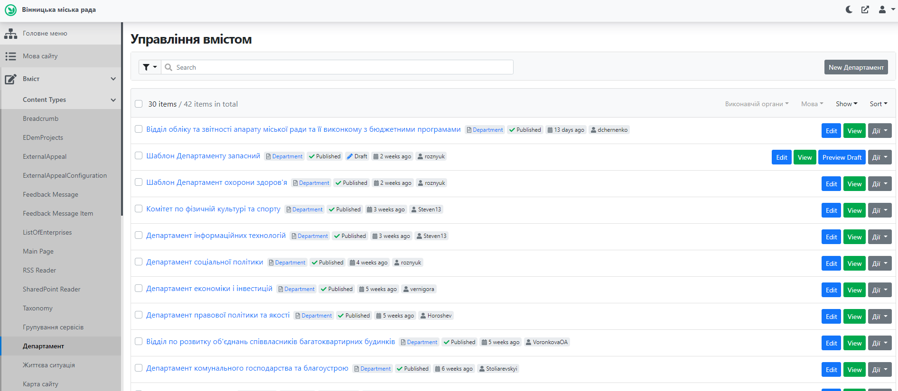
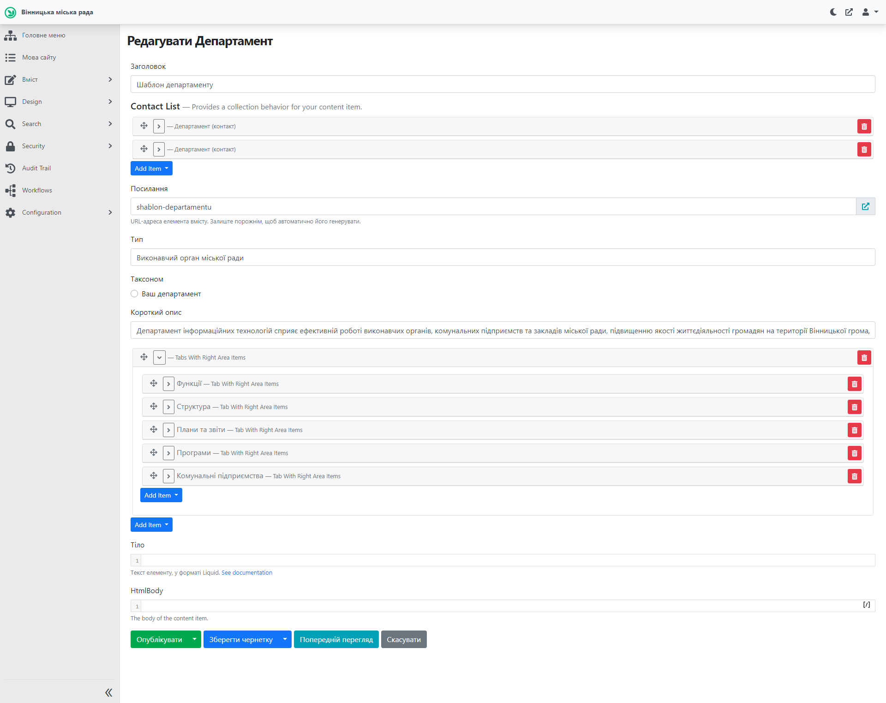
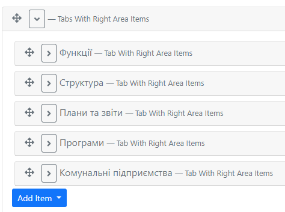
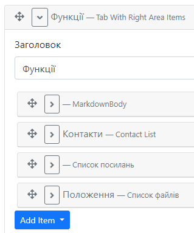
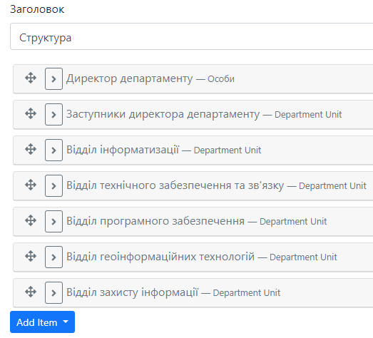

# Робота із сторінкою Департаменту

## Про Департамент

Сторінка департаменту містить усю необхнідну інформацію про виконавчий орган. Сторінки департаменту створюються та наповнюються відповідальною особою, визначеною директором відповідного департаменту.

## Створення та публікація сторінки Департаменту

### Відкриття у Адміністративній панелі

Для роботи з сторінкою департаменту необхідно залогінитись до адміністративної панелі сайту: *[детальніше тут](https://docs.vmr.gov.ua/ContentEditors/ContentEditor_Manual/#_2)*.

Після цього потрібно розкрити список "Вміст", натиснувши на , аналогічно розкрити список "Content Types" (Типи вмісту), прокрутити (пролистати) колесом миші, обрати пункт Департамент.

### Створення Департаменту

Буде розглянуто процес створення з шаблону. У списку департаментів потрібно знайти сторінку "Шаблон департаменту" та клонувати (скопіювати) її:
- праворуч від назви кнопка "Дії"-"Clone"
- змінити на сторінці копії вміст поля "заголовок" на назву вашого департаменту українською 
- видалити вміст "Посилання"
- Опублікувати зміни (кнопка "Опублікувати" унизу)
- Зайти в картку, що називається іменем створеного вами Виконавчого органу і редагувати її поля, відповідно замінюючи вміст на власний.

> ВАЖЛИВО: Створити (заповнити) обов'язкові таби: Функції; Структура; Плани Та Звіти; Програми; Комунальні Підприємства (в разі наявності); інші - за потребами вашого виконавчого органу.

Нижче подано сторінку-шаблон в адміністративній панелі.

### Таби та поля

**Заголовок** - назва виконавчого органу (департаменту)

**Contact List** - контакти (номер телефону та Email департаменту). Новий тип контакту додається при натисканні "Add Item" - "Департамент (контакт)", далі потрібно обрати тип та додати інформацію. Поле призначене для відображення контактів у віджеті «Відповідальний департамент» на інших сторінках (на сторінці департаменту не відображається)

**Посилання** - створюється автоматично згідно **Заголовку**

**Тип** - вказати "Виконавчий орган міської ради"

**Короткий опис** - короткий опис про діяльність департаменту

Для відображення основного змісту сторінки департаменту передбачено використання елементу Табів, які у свою чергу містять інформацію у полях. 

У шаблоні подані основні таби, необхідні для заповнення: **Функції**, **Структура**, **Плани та звіти**, **Програми**, **Комунальні підприємства** (за наявності).

Таб **Функції** містить наступні поля: 
 - *[MarkdownBody](https://docs.vmr.gov.ua/ContentEditors/ContentEditor_Manual/#_6)* - перелік функцій тепартаменту у вигляді списку.
 - Контакти: телефон, E-mail
 - *[Список посилань](https://docs.vmr.gov.ua/ContentEditors/ContentEditor_Manual/#_12)* - два посилання: на форму звернень та на відповіді на зверненння (та графіки роботи (якщо є).
 - *[Список файлів](https://docs.vmr.gov.ua/ContentEditors/ContentEditor_Manual/#_14)* - файл Положення.

 Таб **Структура** містить наступні поля (відповідно до структури департаменту та назви відділів): 
 
 

 Поле Особи - використовується для додавання інформації про Директора департаменту. Для початку потрібно створити профіль особи: детальніше *[тут](https://docs.vmr.gov.ua/ContentEditors/CreateOfficial/)*. 

&nbsp;

ФУНКЦІЇ

Опис простою мовою функції департаменту  

- Контакти  

- посилання на форму звернень

- Файл Положення 

&nbsp;

СТРУКТУРА 

Структурне представлення штату виконавчого органу від керівника і заступників до працівників у розрізі управлінь/відділів 

&nbsp;
 
ПЛАНИ ТА ЗВІТИ  

Списки файлів планів та звітів департаменту 

&nbsp;
 
ПРОГРАМИ 

Перелік Програм, розроблених виконавчим органом з вмістом: 

- короткий опис,  

- файли рішень про затвердження, зміни,  

- Файли звітів про виконання 

&nbsp;

КОМУНАЛЬНІ ПІДПРИЄМСТВА 

Коротка інформація про підпорядковані КП (назва, контакти, керівник) 

Посилання на сторінку КП додається після створення такої сторінки  

&nbsp;

Майбутні вкладки:

&nbsp;

ФІНАНСИ

Тут буде інформація про бюджетні програми 

Не потрібно вносити інформацію про бюджетні програми зараз. Методика буде надана пізніше. 

&nbsp;

РАДИ, КОМІСІЇ (КОНСУЛЬТАТИВНО-ДОРАДЧІ ОРГАНИ) 

Не потрібно поки вносити інформацію про ради або комісії. Методика буде розроблена додатково і надана. 

&nbsp;

ІНШІ ВКЛАДКИ 

Інші вкладки, що вважає за потрібне розмістити виконавчий орган - після опрацювання та надання методики 

&nbsp;

Вигляд дизайну сторінки департаменту розроблений дизайнером:

## Адміністративна панель

Для роботи зі сторінкою «Департамент» необхідно у списку «Типи вмісту»
розділу «Вміст» обрати пункт «Департамент»:

Або натиснути кнопку "редагувати" на сторінці вашого департаменту

####  Створення та публікація сторінки «Департамент»

Для створення нової сторінки департаменту необхідно натиснути кнопку

«» на сторінці зі списком департаментів.
Відкриється форма створення сторінки департаменту:

## Заголовок

В поле заголовок вноситься назва Департаменту.
 - вказати назву департаменту.

**Контакти департаменту** -- призначений для відображення контактів у
віджеті «Відповідальний департамент» на інших сторінках (на сторінці
департаменту не відображається):

\- обрати тип контакту.

> \- зазначити номер телефону або емейл.

## Посилання на дану сторінку:
\- URL-адреса елемента вмісту. Залиште порожнім, щоб автоматично його генерувати.
Автоматично формується по назві депертаменту та відображається для редагуварня після публікації посилання .
> Увага зніна данного параметру призведе до того, що небудуть працювати посилання на ваш департамент розміщені на інших ресурсах та деякі посилання в середені сайту.

 - вказати «Виконавчий орган міської
ради».

\- додати короткий опис.

Для відображення основного змісту сторінки департаменту передбачено
використання елементу «Tabs With Right Area Items (Вкладки)», що
складається з окремих вкладок -- «Tab With Right Area Items» - робота з
віджетом описана у п. 4.6.10.

Для публікації сторінки департаменту необхідно натиснути
«».

## Короткий опис департаменту

Таби:
Функції департаменту:

Опис простою мовою функції департаменту  

Контакти, посилання на форму звернень  та графіки роботи (якщо є) 

Файл Положення 

Писати посилання на декларації

#### Редагування сторінки «Департамент»

Для редагування сторінки департаменту потрібно:

8.  В списку департаментів обрати департамент, що потребує редагування,
    > та натиснути

> «»або на публічній сторінці департаменту
> натиснути «» у хедері.

9.  У формі редагування департаменту внести необхідні зміни.

10. Натиснути
    > «».

Зміни внесені та одразу з'являються на сайті.

<!--Start of Tawk.to Script-->

<!--End of Tawk.to Script-->
