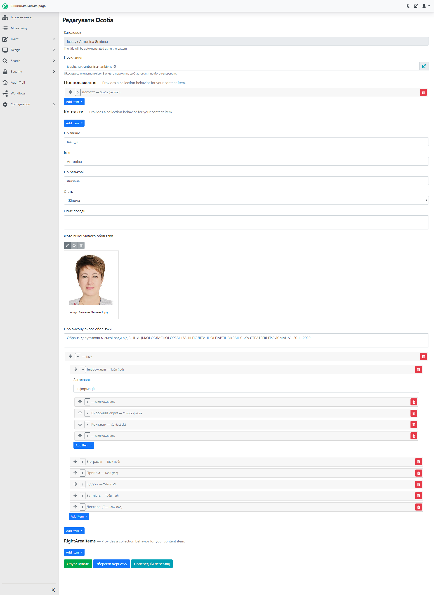
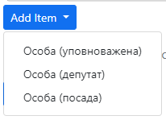
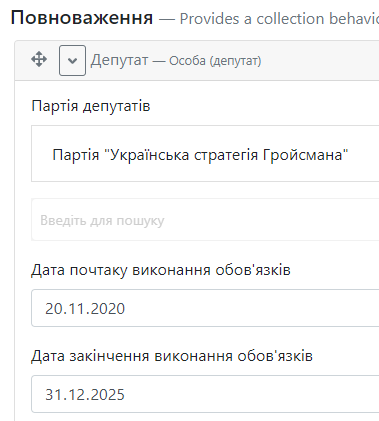
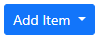
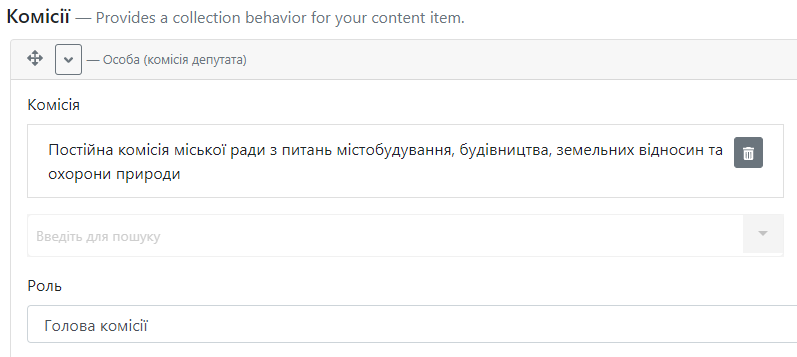
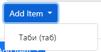
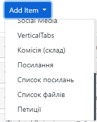
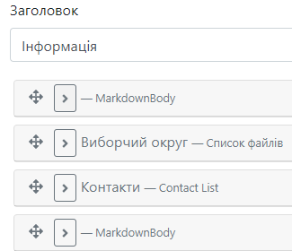
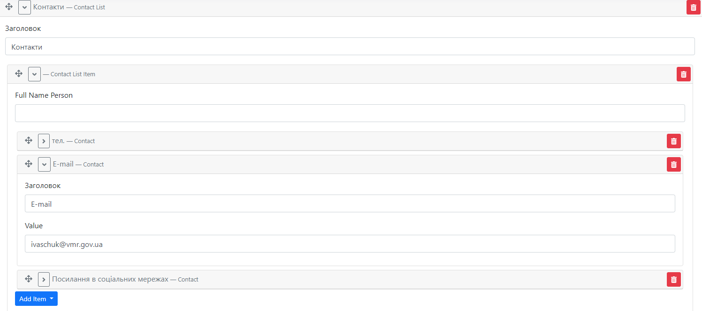
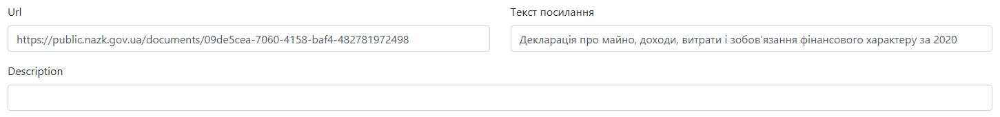

# Створення сторінки депутата/посадової (уповноваженої) особи

## Про сторінки

### Про сторінку депутата

Сторінка депутата містить необхідну інформацію про нього: політична сила, яку він представляє, комісію до якої входить і тд. Перелік усіх депутатів знаходиться *[тут](https://vmr.gov.ua/sklad-miskoi-rady#3)*. При переході за посиланням "Профіль депутата" відкривається персональна сторінка посадової особи, яка містить детальну інформацію про депутата, яка розміщена у вкладках (табах).

### Про сторінку посадової особи

Сторінка посадової особи містить детальну інформацію щодо займаної посади, дати початку (кінця) виконання обов'язків, посилання на щорічні декларації. Ця інформація міститься також у табах. Приклад сторінки посадової особи знаходиться *[тут](https://vmr.gov.ua/romanenko-volodymyr-borysovych)*.

## Створення та публікація сторінок

### Відкриття у Адміністративній панелі

Для роботи з сторінками необхідно залогінитись до адміністративної панелі сайту: *[детальніше тут](https://docs.vmr.gov.ua/ContentEditors/ContentEditor_Manual/#_2)*.

Після цього потрібно розкрити список Вміст, натиснувши на , аналогічно розкрити список "Content Types" (Типи вмісту), прокрутити (пролистати) колесом миші, обрати пункт Список осіб та обрати необхідний список: Список депутатів міської ради чи Список посадових осіб. 

#### Створення сторінки депутата

##### Створення з шаблону

Для спрощення заповнення інформації про нового депутата існує можливість скопіювати наявну сторінку депутата. Необхідно обрати сторінку депутата, яка має найкраще наповнення, та скопіювати її. Здійснити цю дію можливо аналогічно до копіювання сторінки сесії, детальніше *[тут](https://docs.vmr.gov.ua/ContentEditors/CreateSession/#_5)*.

Після створення нової сторінки депутата з шаблону, потрібно змінити інформацію в полях у табах. Опис полів знаходиться *[тут](https://docs.vmr.gov.ua/ContentEditors/CreateDeputy/#_10)*.

##### Створення без шаблону

Після натискання на "Список депутатів міської ради", відкривається перелік сторінок депутатів. 

Для створення нової сторінки депутата потрібно натиснути на 

##### Вкладки (таби) та поля (віджети)
Сторінка депутата містить вкладки, які у свою чергу містять поля для заповнення їх інформацією. Для прикладу буде розглядатись уже заповнена сторінка депутата: *[посилання](https://vmr.gov.ua/ivashchuk-antonina-iankivna-0)*.

**Заголовок** - ПІБ депутата.

**Посилання** - генерується автоматично згідно Заголовку.

**Повноваження** - натиснути на Add Item та обрати "Особа (депутат)"  Додається блок, який містить наступні поля:

 

Партія депутатів - обрати зі списку партію (*[детальніше про списки класифікаторів](https://vmr.gov.ua/ivashchuk-antonina-iankivna-0)*).

Дата початку (закінчення) виконання обов'язків - увести дати. 

Якщо депутат належить до комісії потрібно натиснути на . Буде додано блок комісії.

Комісія - обрати назву комісії із списку (*[детальніше про списки класифікаторів](https://vmr.gov.ua/ivashchuk-antonina-iankivna-0)*). 

Роль - обрати роль із списку.

**Контакти** - увести ПІБ у відповідні поля та обрати стать.

Фото виконуючого обов'язки - додати фото із Медіа-бібліотеки.
*[Робота з Бібліотекою медіа](https://docs.vmr.gov.ua/ContentEditors/ContentEditor_Manual/#-_1)*
*[Детальний опис додавання файлу зображення](https://docs.vmr.gov.ua/ContentEditors/ContentEditor_Manual/#image)*

Про виконуючого обов'язки - інформація про партію та дату обрання.

Блок **Таби** дозволяє додавати вкладки із полями. На скріншоті вище видно, що на сторінку додано 6 табів: Інформація, Біографія, Прийом, Відгуки, Звітність, Декларації. За необхідності додавання нового табу потрібно натиснути на Add Item - Таби (таб) . Таб може містити різні потрібні поля, наприклад: текстове поле MarkdownBody, Список файлів, Список посилань, Контакти. Щоб додати нове поле до табу потрібно натиснути на Add Item та обрати потрібне поле із списку .

Таб **Інформація** - містить наступні поля: 
 *[MarkdownBody](https://docs.vmr.gov.ua/ContentEditors/ContentEditor_Manual/#_6)*
*[Список файлів](https://docs.vmr.gov.ua/ContentEditors/ContentEditor_Manual/#_14)* 
Контакти. Віджет Контакти має наступну структуру: додається новий контакт (Add Item - Contact), Заголовок - назва (*наприклад "E-mail"*), Value - значення (*наприклад "ivaschuk@vmr.gov.ua"*).

Таби **Біографія** та **Прийом** - містять поля *[MarkdownBody](https://docs.vmr.gov.ua/ContentEditors/ContentEditor_Manual/#_6)*.

Таби **Відгуки** та **Звітність** - містять поля *[Список файлів](https://docs.vmr.gov.ua/ContentEditors/ContentEditor_Manual/#_14)*.

Таб **Декларації** - містить поле *[Список посилань](https://docs.vmr.gov.ua/ContentEditors/ContentEditor_Manual/#_12)*. Приклад заповнення:

#### Створення сторінки посадової (уповноваженої) особи

##### Створення з шаблону

Для спрощення заповнення інформації про нову посадову особу потрібно скопіювати сторінку "Шаблон посадової особи" у "Списку посадових осіб" та внести до неї необхідні зміни. Здійснити цю дію можливо аналогічно до копіювання сторінки сесії, детальніше *[тут](https://docs.vmr.gov.ua/ContentEditors/CreateSession/#_5)*.

##### Створення без шаблону

Після натискання на "Список посадових осіб", відкривається перелік сторінок посадових осіб. Для створення нової сторінки особи потрібно натиснути на 

##### Вкладки (таби) та поля (віджети)
Сторінка посадової особи містить вкладки, які у свою чергу містять поля для заповнення їх інформацією. Для прикладу буде розглядатись уже заповнена сторінка посадової особи: *[посилання](https://vmr.gov.ua/romanenko-volodymyr-borysovych)*.

Таби та їх наповнення схожі з табами на сторінці депутата: *[посилання](https://docs.vmr.gov.ua/ContentEditors/CreateDeputy/#_10)*. У цьому розділі будуть розглянуті лише відмінності із сторінкою депутата.

**Повноваження** - потрібно обрати "Add Item - Особа (посада)" для посадової особи і "Add Item - Особа (уповноважена)" для уповноваженої особи. 

Посада - обрати посаду зі списку (*[детальніше про списки класифікаторів](https://vmr.gov.ua/ivashchuk-antonina-iankivna-0)*).

**Контакти**
 
 Опис посади - короткий опис поля діяльності.
 
 Про виконуючого обов'язки - дата призначення на посаду.

 Блок **Таби** містить наступні таби: Інфо, Біографія, Прийом, Декларація. Вони містять елементи, які *[описані](https://docs.vmr.gov.ua/ContentEditors/CreateDeputy/#_10)* у відповідному розділі про сторінку депутата.

## Редагування сторінок

Для редагування сторінок потрібно:

1.  *[Перейти](https://docs.vmr.gov.ua/ContentEditors/CreateDeputy/#_6)* до потрібного списку в адміністративній панелі, обрати сторінку депутата чи посадової особи, що потребує редагування та натиснути  або на публічній сторінці особи натиснути на . Цей елемент знаходиться поруч з кнопкою пошуку у верхній частині сторінки сайту. 
>ВАЖЛИВО: елемент  з'являється лише, коли Редактор залогінений (здійснив вхід) до адміністративної панелі сайту.

2.  У формі редагування новини внести необхідні зміни.

3.  Натиснути 

Зміни внесені та одразу з'являються на сайті.

>ВАЖЛИВО: інструмент "Попередній перегляд" дозволяє *переглянути* виконані зміни перед збереженням. Зміни зберігаються *тільки* після натиснення кнопки "Опублікувати".

