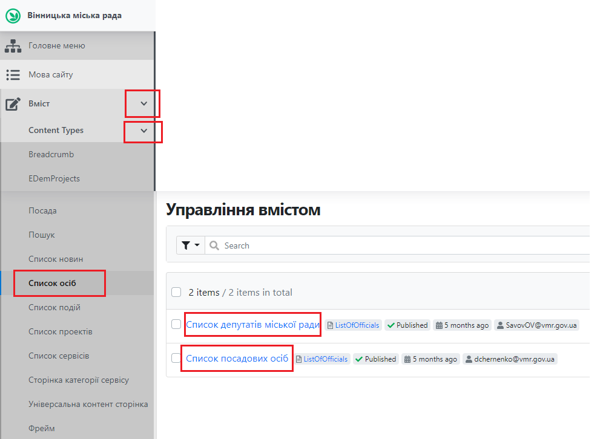
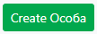

# Створення сторінки депутата/посадової (уповноваженої) особи

## Про сторінки

### Про сторінку депутата

Сторінка депутата містить необхідну інформацію про нього: політична сила, яку він представляє, комісію до якої входить і тд. Перелік усіх депутатів знаходиться *[тут](https://vmr.gov.ua/sklad-miskoi-rady#3)*. При переході за посиланням "Профіль депутата" відкривається персональна сторінка посадової особи, яка містить детальну інформацію про депутата, яка розміщена у вкладках (табах).

### Про сторінку посадової особи

Сторінка посадової особи містить детальну інформацію щодо займаної посади, дати початку (кінця) виконання обов'язків, посилання на щорічні декларації. Ця інформація міститься також у табах. Приклад сторінки посадової особи знаходиться *[тут](https://vmr.gov.ua/romanenko-volodymyr-borysovych)*.

## Створення та публікація сторінок

### Відкриття у Адміністративній панелі

Для роботи з сторінками необхідно залогінитись до адміністративної панелі сайту: *[детальніше тут](https://docs.vmr.gov.ua/ContentEditors/ContentEditor_Manual/#_2)*.

Після цього потрібно розкрити список Вміст, натиснувши на , аналогічно розкрити список "Content Types" (Типи вмісту), прокрутити (пролистати) колесом миші, обрати пункт Список осіб та обрати необхідний список: Список депутатів міської ради чи Список посадових осіб. 

#### Створення сторінки депутата

##### Створення з шаблону

Для спрощення заповнення інформації про нового депутата існує можливість скопіювати наявну сторінку депутата. Необхідно обрати сторінку депутата, яка має найкраще наповнення, та скопіювати її. Здійснити цю дію можливо аналогічно до копіювання сторінки сесії, детальніше *[тут](https://docs.vmr.gov.ua/ContentEditors/CreateSession/#_5)*.

Після створення нової сторінки депутата з шаблону, потрібно змінити інформацію в полях у табах. Опис полів знаходиться *[тут](https://vmr.gov.ua/romanenko-volodymyr-borysovych)*.

##### Створення без шаблону

Після натискання на "Список депутатів міської ради", відкривається перелік сторінок депутатів. 

Для створення нової сторінки депутата потрібно натиснути на 

##### Вкладки (таби) та поля

##### Створення сторінки депутата/уповноваженого

\- вибір партії, яку представляє депутат.

\- вказати дату початку виконання обов'язків посадовою особою. Для
депутата необхідно обов'язково вказати дату закінчення виконання
обов'язків (+ 5 років від дати виборів).

\- вибір комісії, до якої входить депутат.

\- вибір ролі депутата у складі комісії.

Для уповноваженого необхідно вказати лише дату початку та закінчення
виконання обов'язків.

#### Редагування сторінки посадової особи

Для редагування сторінки особи потрібно:

5.  В списку осіб обрати сторінку, що потребує редагування, та натиснути

> «» або на публічній сторінці посадової
> особи натиснути
> «» у хедері.

6.  У формі редагування сторінки особи внести необхідні зміни.

7.  Натиснути
    > «».

Зміни внесені та одразу з'являються на сайті.