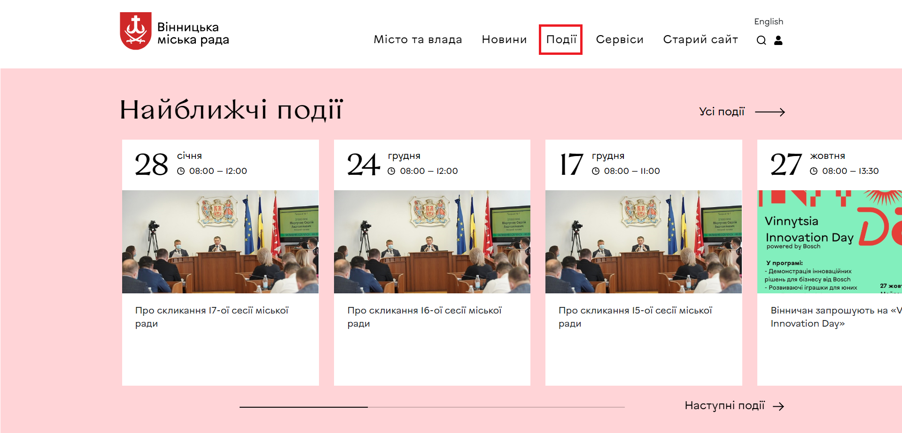
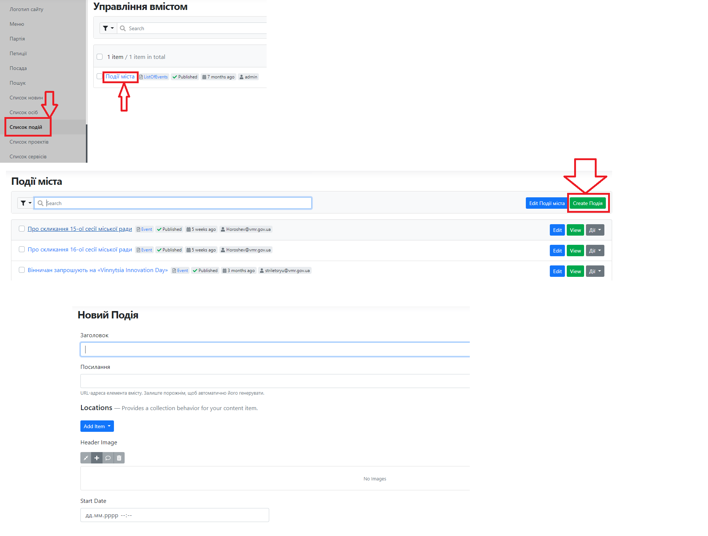
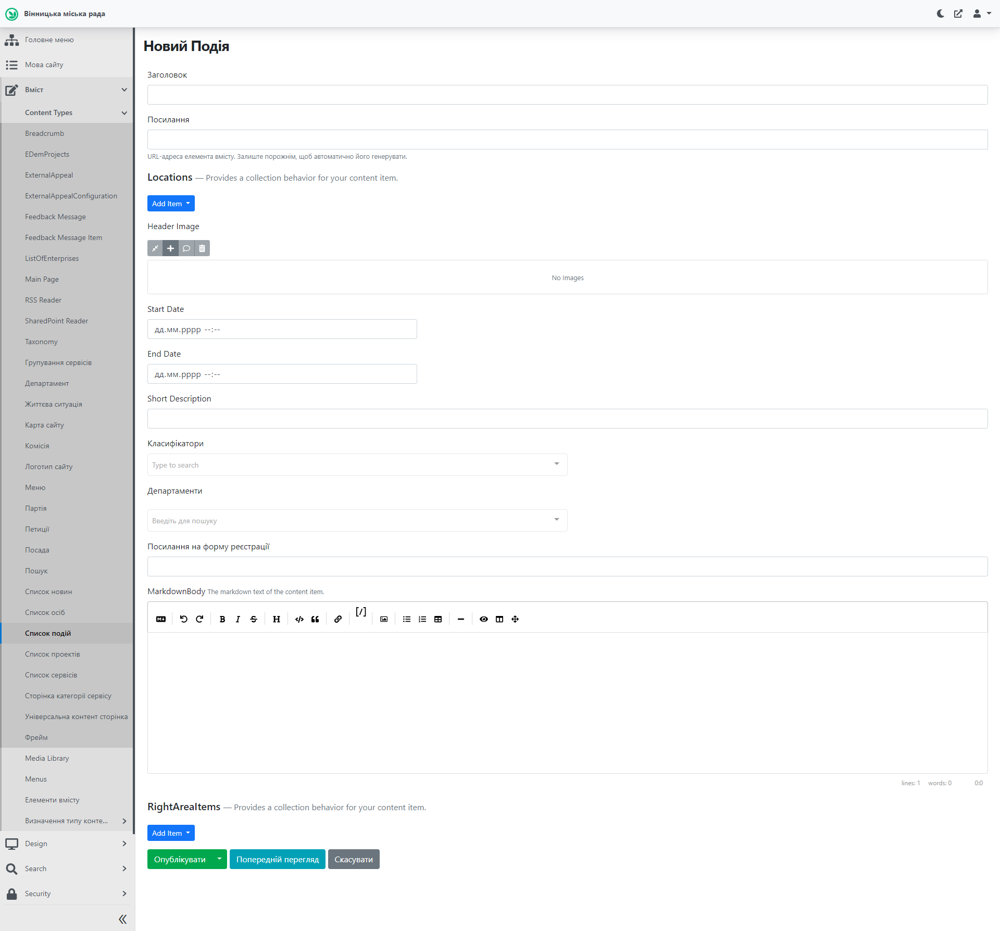
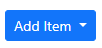
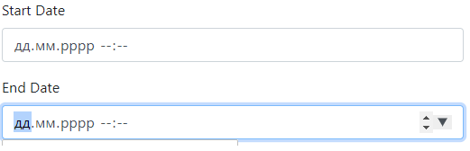
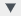
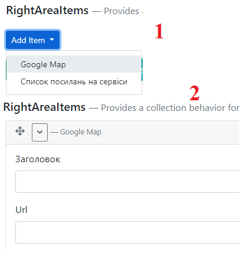
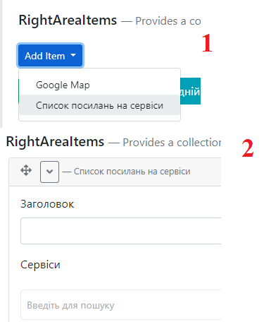
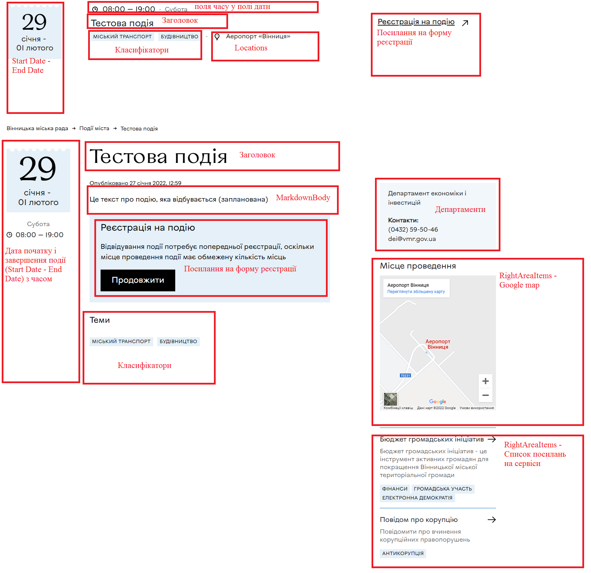

# Створення Події

## Про "Події"
Блок Події - це елемент головної сторінки, пункт меню та складова частина інших сторінок.

Блок Найближчі події на головній сторінці має визначену структуру. У "каруселі" першими відображаються події, які найближчі до поточної дати. За натисканням на Усі події здійснюється перехід до списку усіх подій.

##  Створення та публікація подій

### Відкриття у Адміністративній панелі

Процес входу до адіміністративної панелі та відкриття форми створення Події аналогічний до відкриття форми створення Новини: *[детальніше тут](https://docs.vmr.gov.ua/ContentEditors/CreateNews/#_4)*.

Проте для роботи з Подіями небхідно обрати Список подій - Події міста - Create Подія. В результаті відкриється форма створення події. Про сторінку створення події вказано в наступному розділі.

###  Створення події

Після проведення дій з попереднього розділу, відкривається форма створення події:

 - ввести назву події.

 - url-адреса формується автоматично, поле заповнювати не потрібно.

Locations - призначений для можливості вказати посінформацію про місце проведення. Для додавання іформації потрібно натиснути на  та натиснути на "Подія (локація)" для розкриття форми:

Заголовок - вказати назву місця проведення

Посилання - вказати посилання на місце проведення (точка координат на Google maps).

 - вибір головного зображення події. 
*[Робота з Бібліотекою медіа.](https://docs.vmr.gov.ua/ContentEditors/ContentEditor_Manual/#-_1)*
*[Детальний опис додавання файлу зображення](https://docs.vmr.gov.ua/ContentEditors/ContentEditor_Manual/#image)*

 - вибір дати та часу початку та закінчення події. Дата та час вписуються вручну у відповідні комірки. Під час наведення курсором на поле дати з'являється елемент , при натисненні на який відкривається поле календаря.
>ВАЖЛИВО: окрім дати потрібно вказувати час (години і хвилини) 

 - додати короткий опис події.

 - вибір класифікаторів (можна обрати декілька) зі словника.

 - вибір відповідального за подію департаменту.

- вказати посилання на форму реєстрації на
подію (за необхідності).

 - вказати основну інформацію про подію. *[Робота з елементом описана тут.](https://docs.vmr.gov.ua/ContentEditors/ContentEditor_Manual/#_6)*

**RightAreaItems** - елементи для додавання елементів праворуч на сторінці події

**Google Map** - для додаваня потрібно натиснути:

Заголовок - вказати назву місця проведення.

Url - вказати посилання на карту з позначкою місця проведення у форматі
html-коду для вставки карти.

**Список посилань на сервіси** - для додавання потрібно натиснути:

Заголовок - назва блоку відображення на сайті
Сервіси - обрати із списку.

На зображенні нижче подано сторінку події із заповненими та підписаними усіма блоками (на сторінці усіх подій та сторінка події).

>ВАЖЛИВО: у роботі, можливо, додавання усіх блоків до події не є необхідністю. На зображенні додані усі блоки заради наглядності.

## Редагування події

Для редагування події потрібно:

1.  Перейти до списку подій в адміністративній панелі (*детальніше у розділі Створення та публікація подій - Відкриття у Адміністративній панелі*), обрати новину, що потребує редагування та натиснути  або на публічній сторінці новини натиснути на . Цей елемент знаходиться поруч з кнопкою пошуку у верхній частині сторінки сайту. 
>ВАЖЛИВО: елемент  з'являється лише, коли Редактор залогінений (здійснив вхід) до адміністративної панелі сайту.

2.  У формі редагування новини внести необхідні зміни.

3.  Натиснути 

Зміни внесені та одразу з'являються на сайті.

>ВАЖЛИВО: інструмент "Попередній перегляд" дозволяє *переглянути* виконані зміни перед збереженням. Зміни зберігаються *тільки* після натиснення кнопки "Опублікувати".