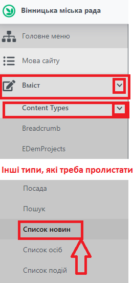
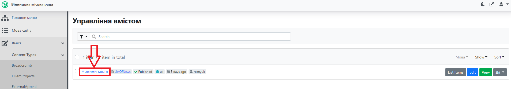
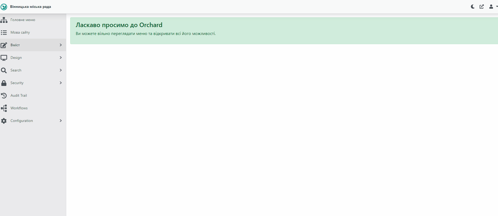
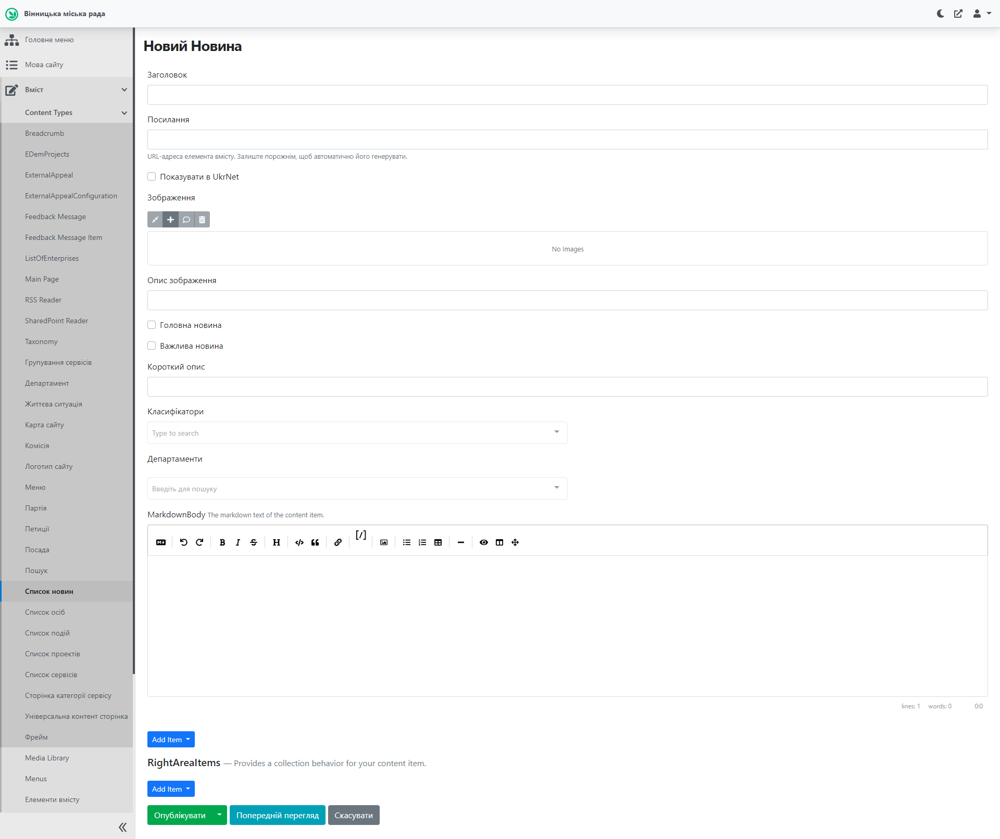
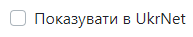
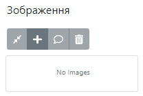
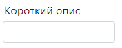
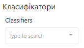
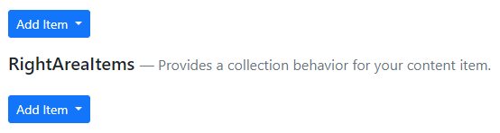
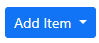

# Створення Новини

##  Про "Новини"
Блок Новини - це елемент головної сторінки, пункт меню та складова частина інших сторінок, наприклад сторінки Виконавчого органу (Департаменту).

Блок Новини на головній сторінці має визначену структуру. Ліворуч знаходиться остання додана новина, яка при створенні мала статус "Головна новина" *(детальніше у розділі ТАКОМУ ТО)*. На сторінці ця новина демонструється із зображенням. Ця новина замінюється щоразу при додаванні нової Новини із статусом "Головна новина". Блок "Важливо!" потрібен для фіксування новини, яка буде значущою для життя міста протягом деякого часу. У цьому блоці знаходиться остання додана новина, яка при створенні мала статус "Важлива новина" *(детальніше у розділі ТАКОМУ ТО)*. Ця новина замінюється щоразу при додаванні нової Новини із статусом "Важлива новина".

##  Створення та публікація новин

### Відкриття у Адміністративній панелі

Для роботи з новинами необхідно залогінитись до адміністративної панелі сайту *(лінк на РОЗДІЛ ТАКИЙ ТО)*. 

Після цього потрібно розкрити список Вміст, натиснувши на , аналогічно розкрити список "Content Types" (Типи вмісту), прокрутити (пролистати) колесом миші та обрати пункт Список новин.

Зрештою відкриється список "Новини міста". Для розкриття списку новин потрібно натиснути на назву.

Для переходу на сторінку створення новини необхідно натиснути кнопку
 на сторінці зі списком новин. Про сторінку створення новини вказано в наступному розділі.

>ВАЖЛИВО: саме кнопка  дозволяє перейти до форми створення новини

Детальніше всі операції показано на анімації нижче.

### Створення та публікація новини

Після проведення дій з попереднього розділу, відкривається форма створення новини:

 - ввести назву новини.

 - url-адреса формується автоматично, поле заповнювати не потрібно

 - відмітити, якщо потрібно, щоб новина відображалась на сайті UkrNet (зазвичай так).

 - вибір головного зображення новини.
*Детальний опис додавання файлу зображення поданий у п. 4.5.*ДОДАТИ

 - додати підпис до зображення (відображається меншим шрифтом під головним зображенням новини).

- відмітити, якщо новина має
відображатися на Головній сторінці Вебпорталу.

- відмітити, якщо новина має статус
«Важливо». Статус «Важливо» означає, що новина впливає на життя містян
протягом певного вказаного часу. Відображається на сторінці каталогу
новин праворуч.

 - додати короткий опис новини (відображається текстом під заголовком, над головним зображенням новини). 

 - вибір класифікаторів (можна обрати декілька) зі словника. Класифікатори описують тему, до якої належить новина, наприклад: Спорт, Культура та ін. На сайті новини відображаються у блоці Теми внизу тексту новини.

 - вибір відповідального за новину департаменту.

 - вказати основну інформацію новини, *робота з
елементом описана у п. 4.1.1.ДОДАТИ* ДОДАТИ вимоги до інформації в новинах, наприклад: тільки текст може містити...

Під текстовим полем MarkdowmBody знаходяться два елементи для додавання інших елементів до новини:

При натисненні на першу клавішу  викликається меню, з якого можна додати наступні елементи:

**Галерея зображень** - додати блок зображень до новини. Цей блок знаходиться під переліком Тем(Класифікаторів) у вигляді квадратних мініатюр зображень, які завантажується через поле описане нижче:

Заголовок - вказати назву до галереї зображень (зазвичай не вказується).

Заголовок в елементі Зображення - вказати підпис до кожного окремого зображення (цей текст буде відображатись при наведенні курсора на зображення в галереї на сторінці новини).

Image + - обрати зображення з Медіа-бібліотеки *Додати посилання як додавати фото*.

На відео нижче зображено приклад додавання галереї зображень до новини та зображень до галереї.

>ВАЖЛИВО: у відео використовується інструмент "Попередній перегляд", який дозволяє *переглянути* виконані зміни перед збереженням. Зміни зберігаються *тільки* після натиснення кнопки "Опублікувати".

**Посилання** - за необхідності додати посилання на ресурси, пов'язані з
новиною, робота з віджетом описана у п. 4.6.1 *додати посилання*

**Список файлів** - за необхідності додати релевантні файли, робота з
віджетом описана у п. 4.6.4 *додати посилання*

Для публікації новини необхідно натиснути
«».

##  Редагування новини

Для редагування новини потрібно:

1.  В списку новин в адміністративній частині обрати новину, що потребує
    > редагування та натиснути
    > «» або на публічній сторінці новини
    > натиснути
    > «» у хедері.

2.  У формі редагування новини внести необхідні зміни.

3.  Натиснути
    > «».

Зміни внесені та одразу з'являються на сайті.