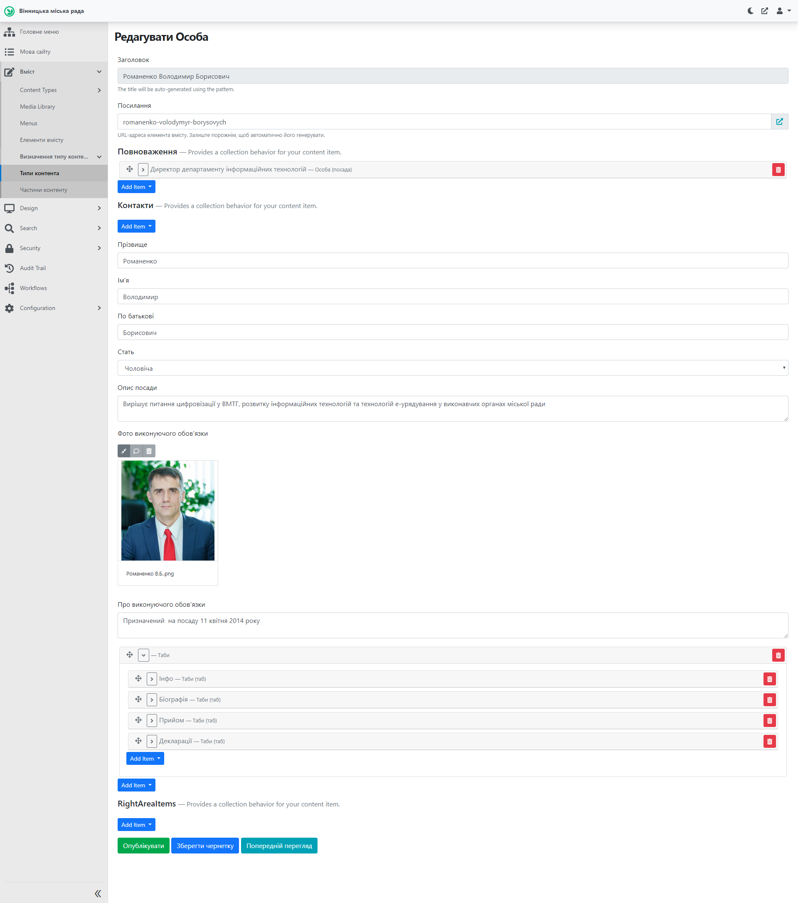
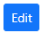
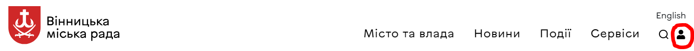

# Створення сторінки Посадової особи

## Про сторінку

Сторінка посадової особи містить детальну інформацію щодо займаної посади, дати початку (кінця) виконання обов'язків, посилання на щорічні декларації. Ця інформація міститься також у табах. Приклад сторінки посадової особи знаходиться *[тут](https://vmr.gov.ua/romanenko-volodymyr-borysovych)*. Для створення сторінки нової посадової особи, що повинна мати таку окрему сторінку (наприклад, директор департаменту), потрібно провести дії, описані у наступних розділах.

## Створення та публікація сторінки Посадової (уповноваженої) особи

### Відкриття у Адміністративній панелі

Для роботи з сторінками необхідно залогінитись до адміністративної панелі сайту: *[детальніше тут](https://docs.vmr.gov.ua/ContentEditors/ContentEditor_Manual/#_2)*.

Після цього потрібно розкрити список Вміст, натиснувши на , аналогічно розкрити список "Content Types" (Типи вмісту), прокрутити (пролистати) колесом миші, обрати пункт Список осіб та обрати необхідний список: Список посадових осіб. 

### Створення з шаблону

Для спрощення заповнення інформації про нову посадову особу потрібно скопіювати сторінку "Шаблон посадової особи" у "Списку посадових осіб" та внести до неї необхідні зміни. Здійснити цю дію можливо аналогічно до копіювання сторінки сесії, детальніше *[тут](https://docs.vmr.gov.ua/ContentEditors/CreateSession/#_5)*, *зокрема потрібно видалити Посилання та вказати новий Заголовок, після чого натиснути Опублікувати. Після цього можна заходити на новостворену сторінку посадової особи та вносити потрібні зміни* . 

#### Створення без шаблону

Після натискання на "Список посадових осіб", відкривається перелік сторінок посадових осіб. Для створення нової сторінки особи потрібно натиснути на 

#### Вкладки (таби) та поля (віджети)
Сторінка посадової особи містить вкладки, які у свою чергу містять поля для заповнення їх інформацією. Для прикладу буде розглядатись уже заповнена сторінка посадової особи: *[посилання](https://vmr.gov.ua/romanenko-volodymyr-borysovych)*.

Таби та їх наповнення схожі з табами на сторінці депутата: *[посилання](https://docs.vmr.gov.ua/ContentEditors/CreateDeputy/#_10)*. У цьому розділі будуть розглянуті лише відмінності із сторінкою депутата.

**Повноваження** - потрібно обрати "Add Item - Особа (посада)" для посадової особи і "Add Item - Особа (уповноважена)" для уповноваженої особи. 

Посада - обрати посаду зі списку (*[детальніше про списки класифікаторів](https://docs.vmr.gov.ua/ContentEditors/ContentEditor_Manual/#_11)*).

**Контакти**
 
 Опис посади - короткий опис поля діяльності.
 
 Про виконуючого обов'язки - дата призначення на посаду.

 Блок **Таби** містить наступні таби: Інфо, Біографія, Прийом, Декларації. Вони містять елементи, які *[описані](https://docs.vmr.gov.ua/ContentEditors/CreateDeputy/#_10)* у відповідному розділі про сторінку депутата, зокрема:

  - таб **Інфо** містить: 
    
    - Інформацію про основні напрямки діяльності посадової особи

    - Контакти (каб., тел., ел.пошта, інше за потребою)

    - Посилання на форми звернення/перегляду відповідей на звернення (при цьому посилання на ці форми брати зі *[старого сайту](https://2021.vmr.gov.ua)*: Розділ "Петиції та звернення громадян", посилання на форми "Написати звернення", "Переглянути публічні відповіді" для конкретної посадової особи)

  - таб **Біографія** містить: біографічні відомості

  - таб **Прийом** містить: 

    - Дні та місце прийому

    - Графік прямих телефонних ліній

  - таб **Декларації** містить: список посилань на опубліковані щорічні декларації.

  >ВАЖЛИВО: Створити чотири обов'язкові таби (які є у шаблоні): Інфо, Біографія, Прийом, Декларації;  інші - за потребами вашого виконавчого органу

## Редагування сторінки Посадової особи

Для редагування сторінки потрібно:

1.  *[Перейти](https://docs.vmr.gov.ua/ContentEditors/CreateDeputy/#_6)* до списку посадових осіб в адміністративній панелі, обрати сторінку особи, що потребує редагування, та натиснути  або на публічній сторінці посадової особи натиснути на . Цей елемент знаходиться поруч з кнопкою пошуку у верхній частині сторінки сайту. 
>ВАЖЛИВО: елемент  з'являється лише, коли Редактор залогінений (здійснив вхід) до адміністративної панелі сайту.

2.  У формі редагування новини внести необхідні зміни.

3.  Натиснути 

Зміни внесені та одразу з'являються на сайті.

>ВАЖЛИВО: інструмент "Попередній перегляд" дозволяє *переглянути* виконані зміни перед збереженням. Зміни зберігаються *тільки* після натиснення кнопки "Опублікувати".

