# Створення сторінки Посадової особи

Подивитися макет дизайнера: 

&nbsp;
Для створення сторінки нової посадової особи, що повинна мати таку окрему сторінку (наприклад, директор департаменту), потрібно:

Перейти в адмінчастину сайту за [посиланням https://new.vmr.gov.ua/Admin/](https://new.vmr.gov.ua/Admin/)

&nbsp;
Працювати зі сторінкою за інструкцією [за цим посиланням](https://docs.vmr.gov.ua/ContentEditors/ContentEditor_Manual/#_31) або унизу сторінки.

&nbsp;
Для зручної роботи можна скористатися шаблоном:

- знайти в списку посадових осіб Шаблон Посадової Особи;
- клонувати його: праворуч від назви кнопка "Actions"-"Clone"
- змінити вміст поля Permalink на транлітеровані ПІБ посадової особи у форматі "prizvyshche-imia-pobatkovi"
- змінити Прізвище, Ім'я, По батькові особи у картці
- Опублікувати зміни (кнопка Publish унизу)
- Зайти в картку, що називається іменем створеної вами Посадової особи і редагувати її. 

&nbsp;
> [**РЕКОМЕНДОВАНО:**]
> 
> **Створити чотири обов'язкові таби: ІНФО; БІОГРАФІЯ; ПРИЙОМ; ДЕКЛАРАЦІЇ; 
> інші - за потребами вашого виконавчого органу**

&nbsp;
ІНФО:

містить
- Інформацію про основні напрямки діяльності посадової особи
- Контакти (каб., тел., ел.пошта, інше за потребою)
- Посилання на форми звернення/перегляду відповідей на звернення

&nbsp;
БІОГРАФІЯ:

містить 
- Біографічні відомості

&nbsp;
ПРИЙОМ:

містить дані
- Дні та місце прийому
- Графік прямих телефонних ліній

&nbsp;
ДЕКЛАРАЦІЇ:

містить
- Список посилань на опубліковані щорічні декларації

### Робота із сторінкою «Посадова особа»

Для роботи зі сторінкою «Посадова особа» необхідно у списку «Типи
вмісту» розділу «Вміст» обрати пункт «Список посадових осіб»:

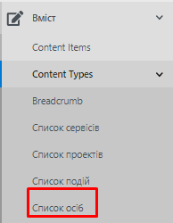

Рисунок 16 - Список осіб в меню

В робочій області зайти на «Список посадових осіб»:

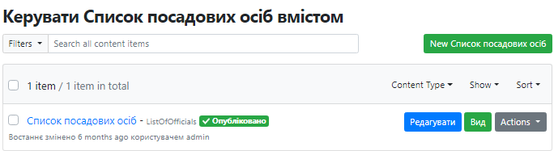

Рисунок 17 - Список посадових осіб

#### Створення та публікація сторінки «Посадова особа»

Для створення нової сторінки посадової особи необхідно натиснути кнопку

«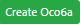» на сторінці зі списком осіб. Відкриється
форма створення сторінки особи:

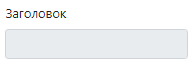 - заголовок створюється автоматично.

 - url-адреса формується автоматично.

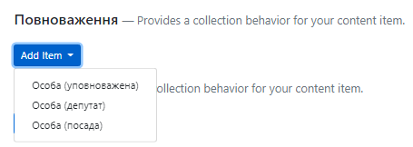

Необхідно обрати вид повноважень для створюваної особи. Опис полів для
посадової особи наведений у пункті 5.5.1.1. Опис полів для створення
сторінки депутата (уповноваженого) -- у пункті 5.5.1.2.

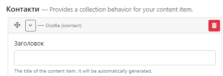

**Блок «Контакти»** призначений для відображення контактів особи на
сторінці звернення.

Заголовок створюється автоматично.

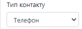

\- вибір типу контактних даних (адреса, телефон, e-mail, інше).

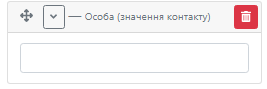

\- ввести контактні дані.

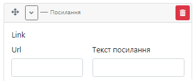

\- при необхідності вказати посилання.

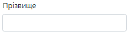 - вказати прізвище посадової особи.

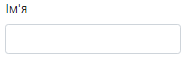- вказати ім'я посадової особи.

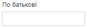

\- вказати по батькові посадової особи.

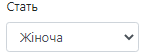

\- обрати стать посадової особи.

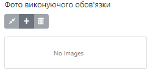

\- обрати фото посадової особи з Медіа-лабораторії.

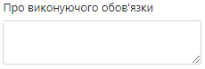

\- додати інформацію про посадову особу.

Для відображення основного змісту сторінки посадової особи передбачено
використання елементу «Tabs (Вкладки)», що складається з окремих вкладок
-- «Tab», робота з віджетом описана у п. 4.6.10.

Для публікації сторінки посадової особи необхідно натиснути
«».

##### Створення сторінки посадової особи

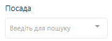

\- вибір посади.

\- вказати дату початку виконання обов'язків посадовою особою. Поки
особа виконує обов'язки, дата закінчення не вказується.

