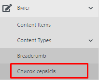
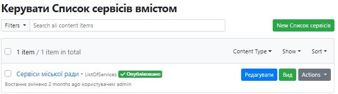
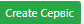
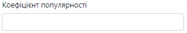

# Робота із сервісами Вебпорталу

##Про сервіси

Сервіси - описані блоки інформації для задоволення потреб громадян.
[Шаблон дизайну сервісу](https://projects.invisionapp.com/share/WFY7D2TXER5#/screens/432196262)

<iframe src="https://www.youtube.com/embed/wgbV6DLVezo" frameborder="0" allow="accelerometer; autoplay; encrypted-media; gyroscope; picture-in-picture" allowfullscreen></iframe>

Сервіс складається з таких блоків:

<iframe width="100%" height="100%" src="https://www.youtube.com/embed/wgbV6DLVezo" frameborder="0" allow="accelerometer; autoplay; encrypted-media; gyroscope; picture-in-picture" allowfullscreen></iframe>

Назва

<iframe width="100%"  height= calc(width/1.77) src="https://www.youtube.com/embed/wgbV6DLVezo" frameborder="0" allow="accelerometer; autoplay; encrypted-media; gyroscope; picture-in-picture" allowfullscreen></iframe>

Теги - (посилання на теги та принципи тегування) [Taxonomi](https://docs.vmr.gov.ua/Administrators/Administrator_Manual/#68-taxonomy)

Дата створення та редагування

Департамент - відповідальний за наповнення інформації про сервіс

Меню якорів на сторінці сервісу - (Посилання на сторінку, що розказує про якоря)

Текстовий опис сервісу (групи сервісів), умови його отримання за різних умов

Посилання на сторінки, де можна отримати детальнішу інформацію (наприклад, посилання на сайт міністерства), скористатись елементами сервісу або супутніми сервісами сервісу або отримати електронну послугу

Додаткова інформація може бути додана у вигляді файлів. Рекомендовано pdf

Блок посилань на інструменти отримання електронних послуг

Місце отримання послуги 

Блок інформації про те, де і як можна отримати додаткову інформацію, допомогу, консультацію.

Нижче приєднуються подібні сервіси, новини, події та проекти, повязані із цим сервісом.

## Початок роботи

Як і яким документом створити сервіс та як його підтримувати та припиняти потребує відповідної методики.

## Для роботи із сервісами 

Необхідно у списку «Типи вмісту» розділу «Вміст» обрати пункт «Список сервісів»:

Рисунок 10 - Список сервісів в меню

В робочій області зайти на список «Сервіси»:

Рисунок 11 - Список «Сервіси міської ради»

##  Створення та публікація сервісу.

Для створення сервісу необхідно натиснути кнопку
«» на сторінці зі списком сервісів.
Відкриється форма створення сервісу:

 - ввести назву сервісу.

 - url-адреса формується автоматично.

**Посилання на іншомовні версії** -- робота з віджетом описана у п.
4.6.1.

 - вказати коефіцієнт популярності.
Призначений для популяризації сервісу та відображення на головній
сторінці Вебпорталу.

\- вибір головного зображення до сервісу. Детальний опис додавання файлу
зображення у п. 4.5.

 - додати короткий опис події.

- вибір класифікаторів зі словника.

\- вибір відповідального за подію департаменту.

Основний зміст сторінки сервісу поділений на інформаційні розділи. Для
відображення розділів сервісу передбачено використання віджету
**«Параграф»** - робота з віджетом описана у п. 4.6.6.

Для швидкого доступу до необхідної інформації на сторінці сервісу
передбачено використання віджету **«Навігація по сторінці (Page
Navigation)»** - робота з віджетом описана у п. 4.6.7.

Для публікації сервісу необхідно натиснути
«».

## Редагування сервісу

Для редагування сервісу потрібно:

1.  В списку сервісів обрати сервіс, що потребує редагування та
    > натиснути

> «»або на публічній сторінці сервісу натиснути
> «» у хедері.

2.  У формі редагування сервісу внести необхідні зміни.

3.  Натиснути
    > «».

Зміни внесені та одразу з'являються на сайті.

[Документація по сервісам](https://docs.vmr.gov.ua/ContentEditors/CreateServices/)
