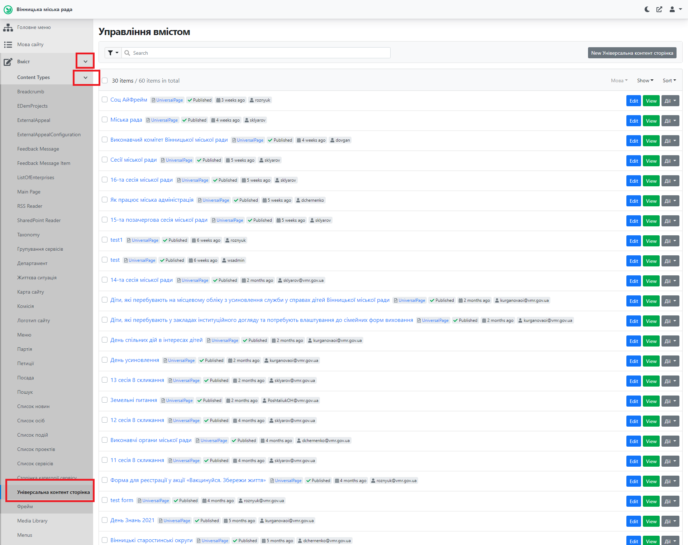
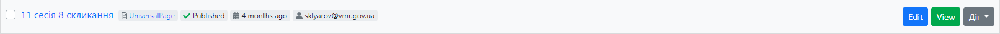
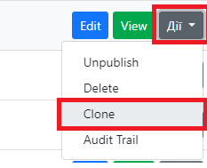
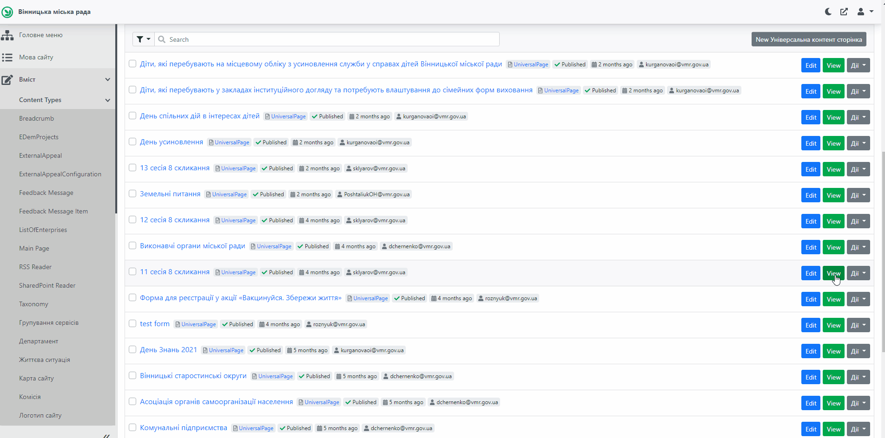
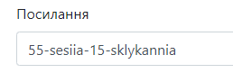
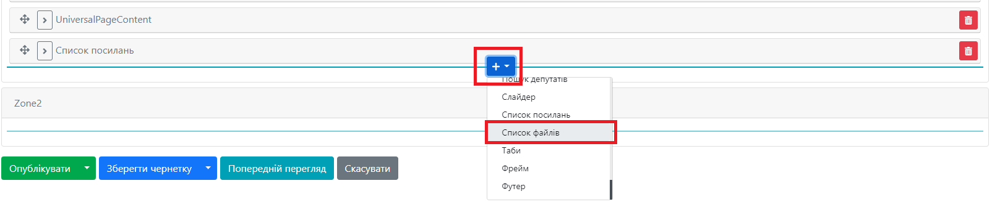
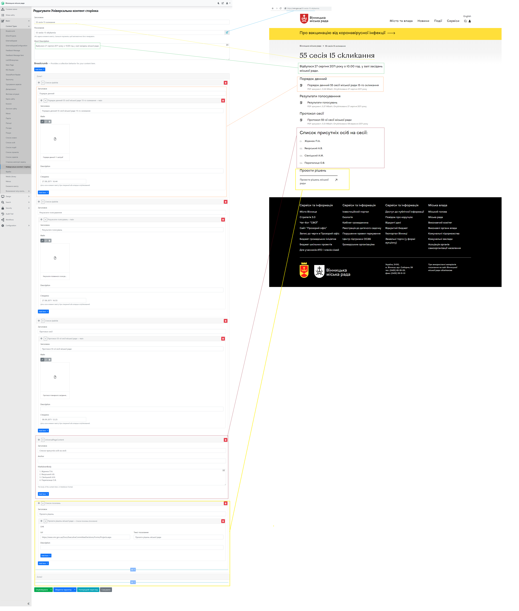
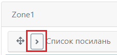
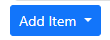
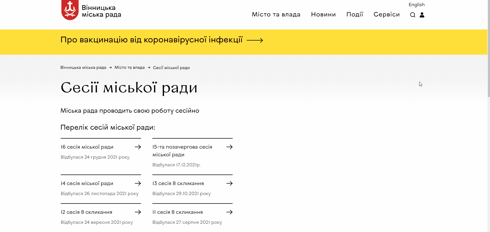

# Створення сторінки сесії

## Про сторінку
Сторінка сесії містить необхідну інформацію щодо проведеної сесії: дата проведення, документи, пов'язані із сесією, проєкти рішень міської ради.

Сторінка сесії є складовою сторінкою усіх сесій міської ради: дана *[сторінка](https://vmr.gov.ua/sesii-miskoi-rady)* містить посилання на сторінки окремих сесій. Детальніше про додавання посилань на сторінки сесій на сторінку усіх сесій описано *[тут](https://docs.vmr.gov.ua/ContentEditors/CreateSession/#_7)*.

##  Створення та публікація сторінки сесії

### Відкриття у Адміністративній панелі

Для роботи з сторінкою сесії необхідно залогінитись до адміністративної панелі сайту: *[детальніше тут](https://docs.vmr.gov.ua/ContentEditors/ContentEditor_Manual/#_2)*.

Після цього потрібно розкрити список Вміст, натиснувши на , аналогічно розкрити список "Content Types" (Типи вмісту), прокрутити (пролистати) колесом миші та обрати пункт Універсальна контент сторінка.

Відкриється список усіх створених сторінок цього типу. У даному списку потрібно знайти попередньостворену сторінку сесії та скопіювати її, використавши її як шаблон для заповнення нової. Для цього підходить сторінка 11 сесії 8 скликання. 

#### Копіювання сторінки
Для копіювання сторінки сесії потрібно:

 - знайти у списку дану сторінку

 - навпроти сторінки натиснути на Дії, а далі обрати Clone

Після цього наверху списку з'явиться клонована сторінка. Їй потрібно дати нову назву, внести необхідні зміни та натиснути кнопку . Процес копіювання сторінки сесії показано нижче.

>ВАЖЛИВО: необхідно змінити поле "Посилання" на новій сторінці згідно до поточного номеру сесії та скликання. Наприклад: "55 сесія 15 скликання" виглядатиме так:

### Створення сторінки сесії
Сторінка сесії за своїм типом є універсальною контент сторінкою. Детальна інформація про даний тип сторінки знаходиться *[тут](https://docs.vmr.gov.ua/ContentEditors/CreateUniversalPage/)*. Сторінка сесії використовує лише деякі з полів, заповнення яких описано нижче.

Заголовок - містить номер сесії та номер скликання

Посилання - потрібно змінити відповідно до номеру сесії та скликання. Наприклад: 

Short Description - короткий опис (коли відбулась та місце проведення)

Zone1 містить наступні поля:

Список файлів - поле, яке містить заголовок *(наприклад "Порядок денний")* та додані файли. Детальніше про роботу з полем за *[посиланням](https://docs.vmr.gov.ua/ContentEditors/ContentEditor_Manual/#_14)*

UniversalPageContent - поле для текстової інформації із заголовком, Anchor - залигити пустим, MarkdownBody - текстова інформація. *(наприклад заголовок - "Список присутніх на сесії осіб" з списком осіб у вкладеному полі MarkdownBody)*

Список посилань - поле для розміщення посилань із заголовком *(наприклад - "Проєкти рішень" із посиланням на дані проєкти)*. Детальніше про роботу з полем *[тут](https://docs.vmr.gov.ua/ContentEditors/ContentEditor_Manual/#_12)*.

>ВАЖЛИВО: у разі необхідності розташування полів можна *[змінювати](https://docs.vmr.gov.ua/ContentEditors/ContentEditor_Manual/#_8)*, додавати нові поля (натиснувши "+" внизу Zone1 та обравши необхідний елемент). 

Для публікації сторінки сесії необхідно натиснути .

Нижче знаходиться вигляд заповненої сторінки в адміністративній панелі та відповідна сторінка на сайті.

##  Редагування сторінки сесії

Для редагування сторінки сесії потрібно:

1.  Перейти до списку Універсальних контент сторінок в адміністративній панелі (*детальніше у розділі Створення та публікація сторінки сесії - Відкриття у Адміністративній панелі*), обрати сторінку сесії, що потребує редагування та натиснути  або на публічній сторінці сторінки сесії натиснути на . Цей елемент знаходиться поруч з кнопкою пошуку у верхній частині сторінки сайту. 
>ВАЖЛИВО: елемент  з'являється лише, коли Редактор залогінений (здійснив вхід) до адміністративної панелі сайту.

2.  У формі редагування новини внести необхідні зміни.

3.  Натиснути 

Зміни внесені та одразу з'являються на сайті.

>ВАЖЛИВО: інструмент "Попередній перегляд" дозволяє *переглянути* виконані зміни перед збереженням. Зміни зберігаються *тільки* після натиснення кнопки "Опублікувати".

## Список сесій

Інформація про усі проведені сесії зберігається на *[сторінці](https://vmr.gov.ua/sesii-miskoi-rady)* сесій. Дана сторінка - це універсальна контент сторінка, яка містить один елемент - *[Список посилань](https://docs.vmr.gov.ua/ContentEditors/ContentEditor_Manual/#_12)*.

Після створення нової сторінки сесій її необхідно додати до списку усіх сесій. Для цього потрібно *[залогінитись](https://docs.vmr.gov.ua/ContentEditors/ContentEditor_Manual/#_2)* до Адміністративної панелі, на публічній сторінці списку сесій натиснути на .

Для додавання посилання у список створеної сесії потрібно:
1.   Розкрити елемент Список посилань, натиснувши на 
2.   Прокрутити список та натиснути 
3.   Заповнити інформацію про сесію: Url (Посилання), Текст посилання і   Description. 
4.   Змінити порядок розташування елементів (посилань на сесії) "перетягуванням" нової сесії наверх списку.
5.   Зберегти зміни, натиснувши .

Процес додавання нової сесії до списку сесій та вигляд списку після цього подано нижче.

